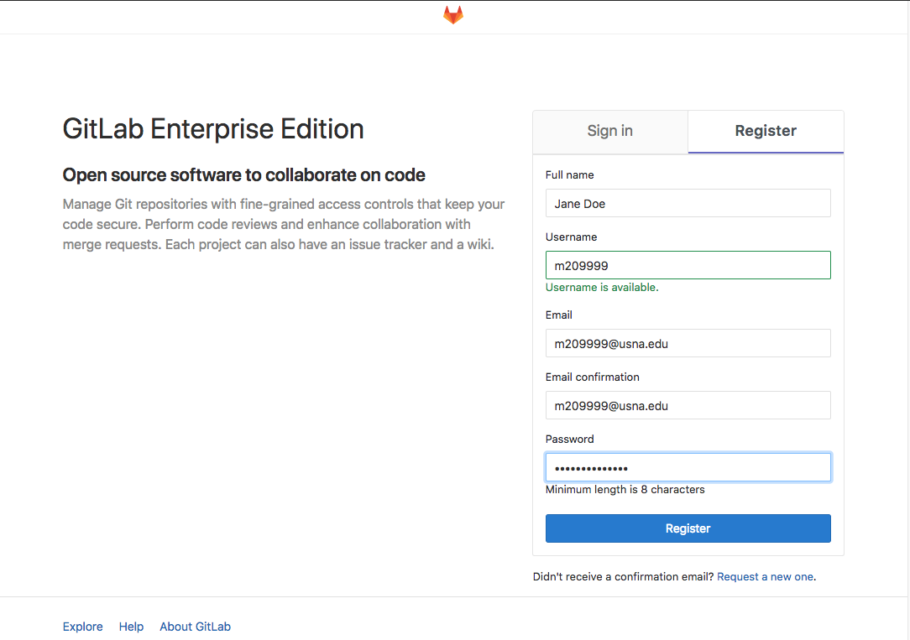
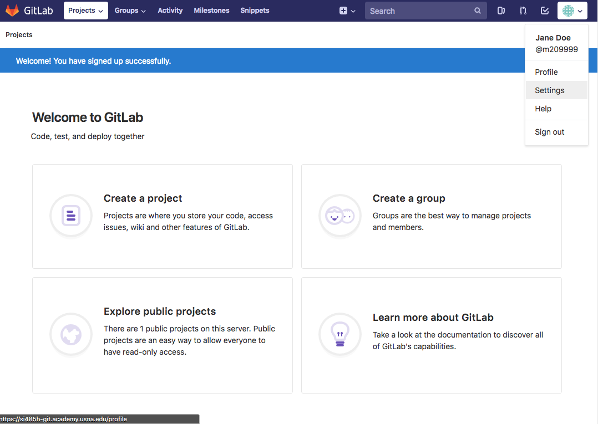
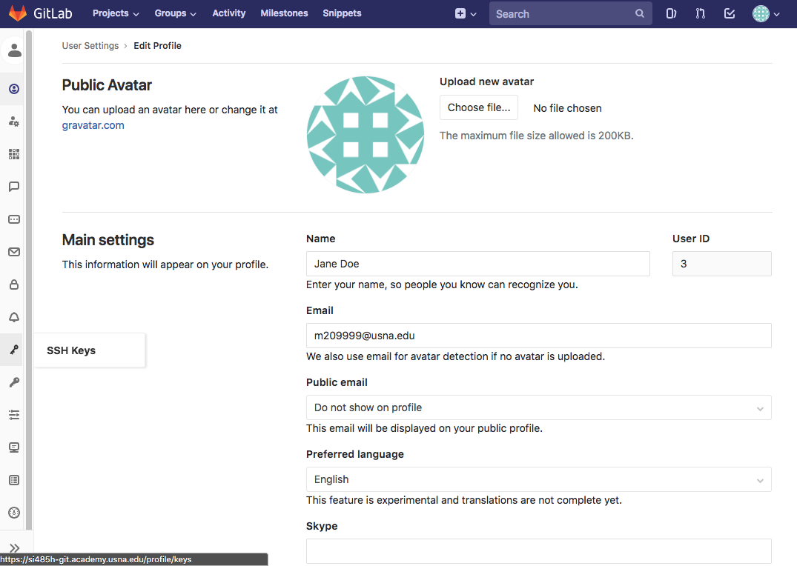
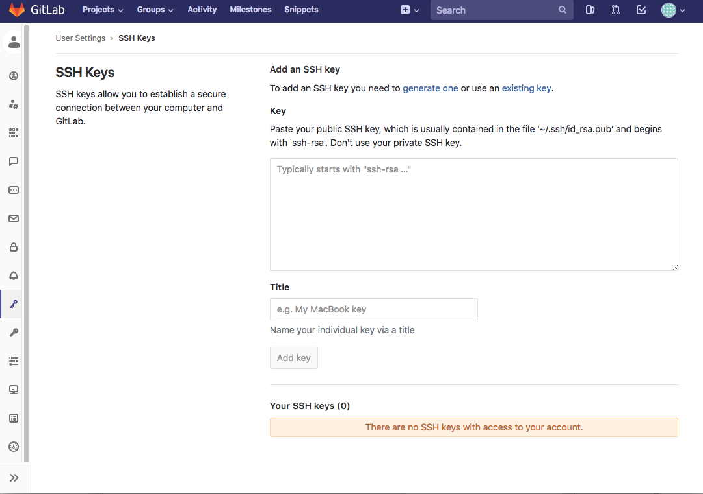

# Gitlab System

We will be using git and gitlab for a number of tasks in this class, including
managing the course content and assignments. It's important that you become both
familiar with git and gitlab.

What is gitlab? Gitlab is a software package to manage git repositories. It
comes with a very nice web interface and other features that make management
much easier. The course gitlab server is found at the following URL

https://si485h-git.academy.usna.edu

Note, it must be https, but the certificate is only self-signed. Sorry.

## Creating a gitlab account

The first time you go to gitlab, you must register a new account. Go
https://si485h-git.academy.usna.edu, click on register, and fill out the
information.




Note that you **MUST** use your network account for the username and your usna
email address. That is because the gitlab system is tied into the VM system.

Next, add your ssh public key, and to do so you need to edit your settings by
clicking in the upper left.



And then select the key option



Here, you'll see a window for you to copy and paste your ssh public key



On your VM, after you've run `ssh-keygen`, you'll have the file
`~/.ssh/id_rsa.pub`. From the terminal in your local VM, you can print it to the
screen using `cat` and copy and paste it into the window in gitlab. Once you've
done so, add the key.

This serves multiple processes. First, it will allow you to clone and push
repositories, but it will also establish this public key on the VM's for the
class. Once you've added your key, you can check if it gave you access to the
VM's by trying to ssh into one from the terminal on your local VM

```
ssh -p 2210 si485h.academy.usna.edu
```

If you do not get a shell and are instead prompted for a password, then
something went wrong. Check that you used the correct username during
registration, and also contact your instructor. 


