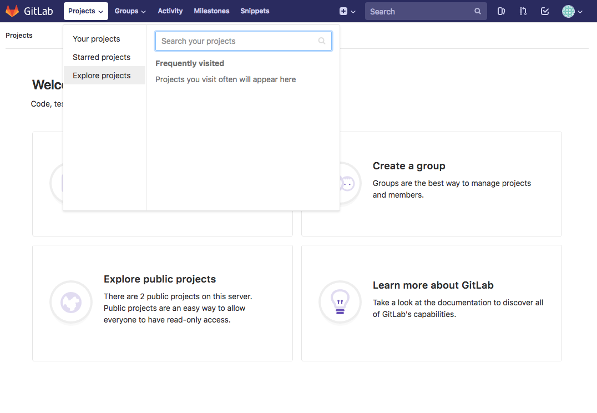
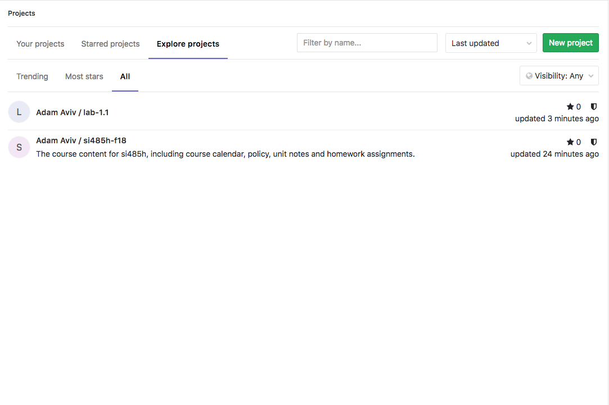
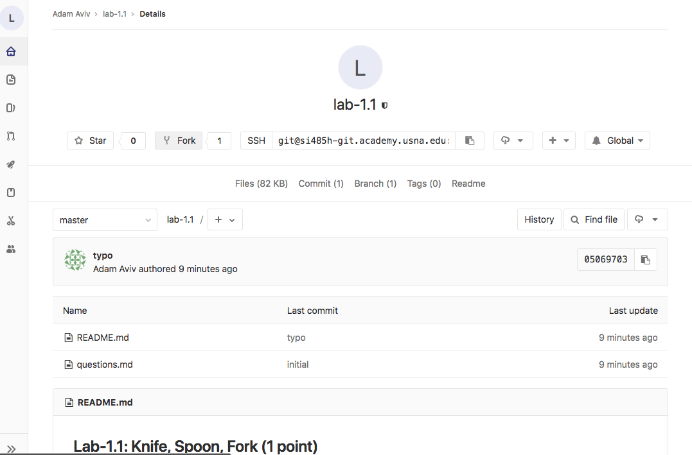
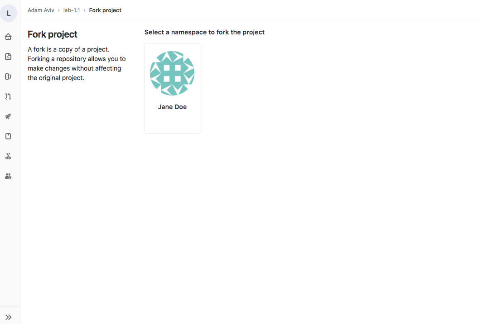
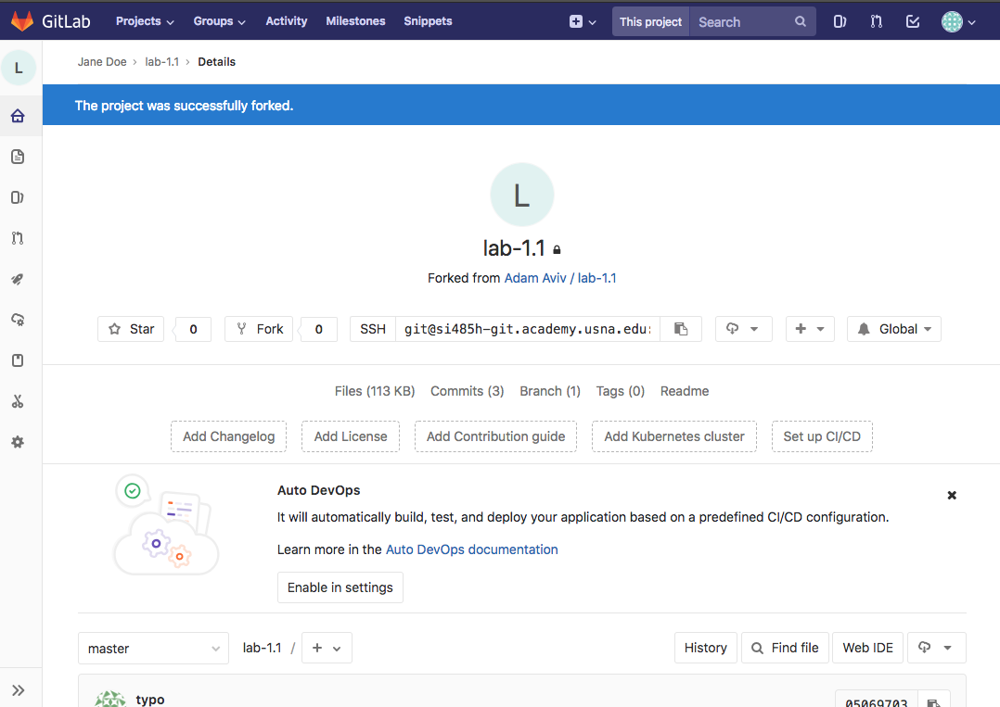
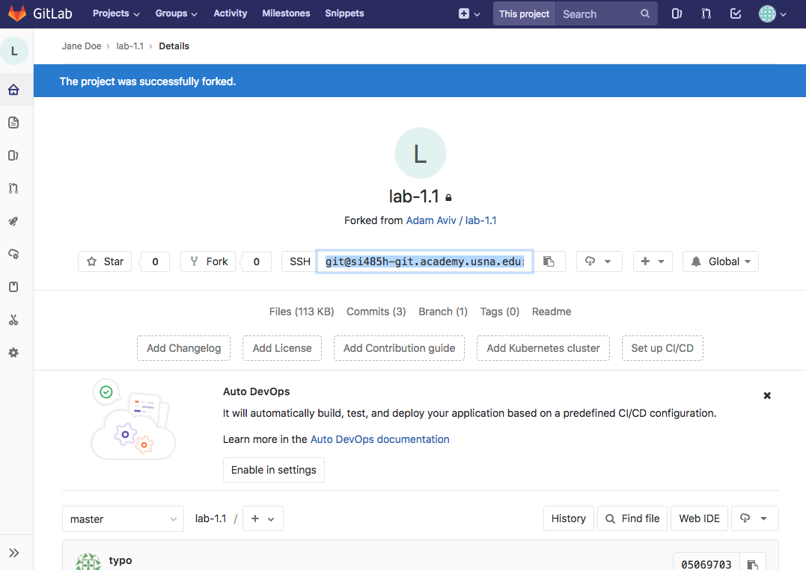
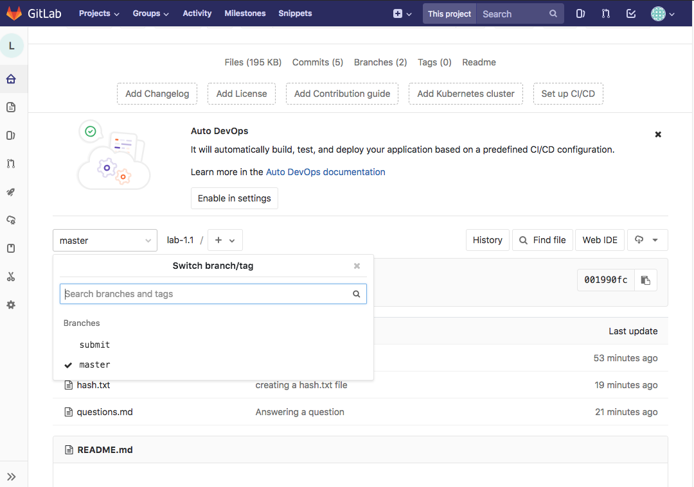
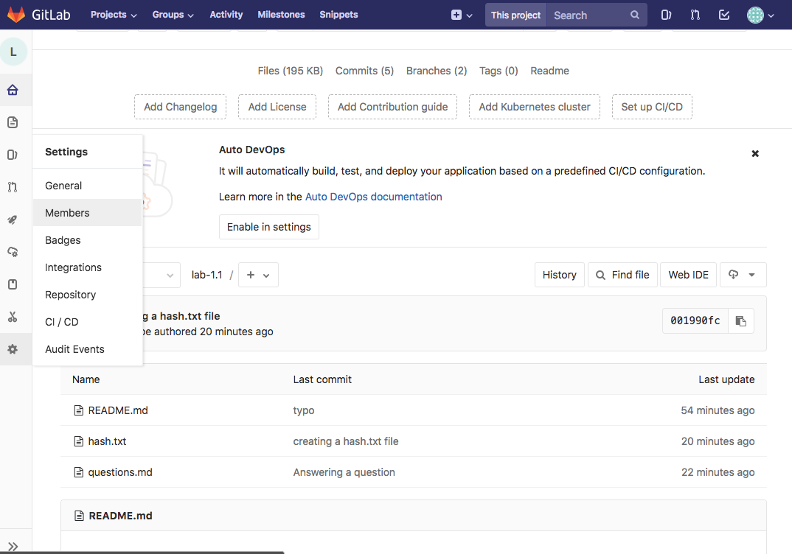
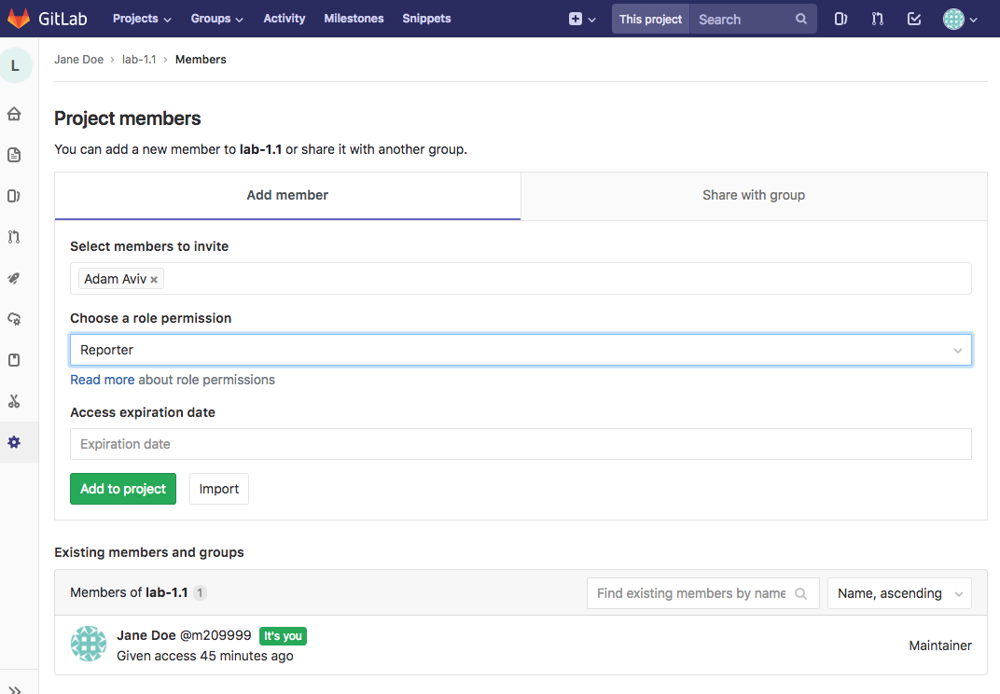
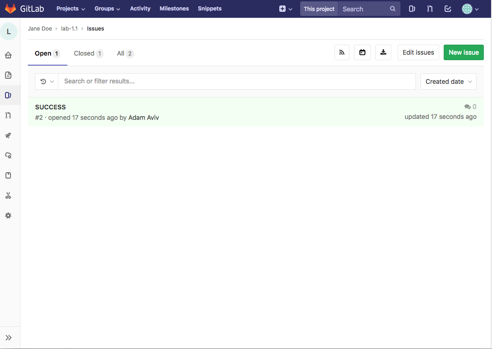

# Lab Submission and Git Usage

All lab assignments and submission will occur via the gitlab system. This will
require you to develop some familiarity with git.

The basic process for submitting a lab is

0. Choose a lab to complete in gitlab
1. **Fork** the lab repository in gitlab so you have your own version of it
2. **Clone** the forked repository on your VM system to a local directory
3. Work and complete the lab!
4. Once finished, create a **branch** called "submit" 
5. **Push** your submit branch to gitlab 
6. Mark your instructor as a "reporter" on the repository to notify submission

Your instructor will then grade the submission, marking it correct or return it
to you with comment if incorrect.

## Finding labs to complete

You can find all the available labs in the gitlab system by exploring available projects. 



You may need to click the "All" tab to see all of the projects available. 



Select the lab you wish to work on from this list. 

## Forking a lab

(*Note, that you DO NOT want to fork the course/class repo
[si485h-f18](aviv/si485h-f18) because you will not be altering the trajectory of
the notes. You should only fork lab projects since you are creating new versions
of the labs for submission*)

On the project page, you'll see a button for "Fork." 




Select it, where you'll see an option for a namespace to fork into. There should
just be your own, user namespace. Select it.



This will cause the fork, and you'll now have your own version of the repository under your namespace. 



## Cloning the repository

Now that the repository is forked, you can clone a local copy. Select the git URL and copy it.



Then on your local VM you can clone it into a directory. I recommend you create
a directory called `labs` just to keep things organized, and have all your lab
repositories there.

The git command for cloning is as follows:

```
git clone git@si485h-git.academy.usna.edu:m209999/lab-1.1.git
```

Now, if you get prompted for a password or receive an error, like so

```
$ git clone git@si485h-git.academy.usna.edu:m209999/lab-1.1.git
Cloning into 'lab-1.1'...
The authenticity of host 'si485h-git.academy.usna.edu (10.53.53.207)' can't be established.
ECDSA key fingerprint is SHA256:BJxh9/FROrJM7vI6NyI3me0Vagw11Hqmb89K4h/as+s.
Are you sure you want to continue connecting (yes/no)? yes
Warning: Permanently added 'si485h-git.academy.usna.edu,10.53.53.207' (ECDSA) to the list of known hosts.
git@si485h-git.academy.usna.edu's password: 
```

That means you haven't setup your public key on this machine with gitlab. See
the [gitlab guide](gitlab.md) for extended details, you'll need to generate a
ssh key-pair with `ssh-keygen` and upload the public key to gitlab. Once you do
that, you should have a successful clone, and a directory for the repsitory will be created.

```
$ git clone git@si485h-git.academy.usna.edu:m209999/lab-1.1.git
Cloning into 'lab-1.1'...
remote: Counting objects: 10, done.
remote: Compressing objects: 100% (7/7), done.
remote: Total 10 (delta 1), reused 10 (delta 1)
Receiving objects: 100% (10/10), done.
Resolving deltas: 100% (1/1), done.
$ ls
lab-1.1
```

Change directories into that repo to complete the lab.

## Add, Commit, Push, and Pull

Once in the cloned repository, you can user the git command to manage the
repository. The big idea behind git is that a repository is distributed, so the
cloned version you have is a local copy. In your local copy, you can modify
files and commit those changes. However, to make those changes available to
others, you must **push** the changes to the remote copy of the repository
stored on gitlab --- sometimes called the origin. You can also **pull** changes
from the origin to your local copy.

### Adding a committing a file

The notion of "adding" in git means that you are "adding a file to be
committed." This can include current files, as in you are modifying them, or new
files to be added. 

For example, suppose I wish to modify the `questions.md` file in lab-1.1 by
answering the first question.

```
$ cat questions.md 

1. Why did you choose to take this elective?

Because it's freakin' awesome!

2. What do you expect to learn?

3. What about this class are you most looking forward to?

4. Tell me something I don't know!
```

This file has been modified, and we can see this with a `git status` command,

```
$ git status 
On branch master
Your branch is up to date with 'origin/master'.

Changes not staged for commit:
  (use "git add <file>..." to update what will be committed)
  (use "git checkout -- <file>..." to discard changes in working directory)

	modified:   questions.md

no changes added to commit (use "git add" and/or "git commit -a")
```

Notice that the file is **not** staged for commit because we have not added it
yet to the next commit.

```
$ git status 
On branch master
Your branch is up to date with 'origin/master'.

Changes to be committed:
  (use "git reset HEAD <file>..." to unstage)

	modified:   questions.md
```

Now it is listed as staged. We can then proceed with the commit. 

```
$ git commit -m "Answering a question"
[master 8952e92] Answering a question
 1 file changed, 2 insertions(+)
```

The `-m` option is the message. If you leave this off, a editor will open which
you can use to complete the message.

(*Note you may get prompted to complete some git configs ... do so*)

Congratulations, you've completed a commit to your local repo!

## Adding a new file

You can follow the same instructions above for adding a new file, but when you
create a new file, the status will described this as an "untracked file"

```
$ touch hash.txt
(...)
$ git status
On branch master
Your branch is ahead of 'origin/master' by 1 commit.
  (use "git push" to publish your local commits)

Untracked files:
  (use "git add <file>..." to include in what will be committed)

	hash.txt

nothing added to commit but untracked files present (use "git add" to track)
```

You have to add the file for it be staged, and then finish the commit. 

```
$ git add hash.txt 
$ git status 
On branch master
Your branch is ahead of 'origin/master' by 1 commit.
  (use "git push" to publish your local commits)

Changes to be committed:
  (use "git reset HEAD <file>..." to unstage)

	new file:   hash.txt

$ git commit -m "creating a hash.txt file"
[master 001990f] creating a hash.txt file
 1 file changed, 0 insertions(+), 0 deletions(-)
 create mode 100644 hash.txt
```

## Pushing changes to the remote repo

Now that you've finished all your local modifications to the repository, you may
want to push your changes to the remote repository. You do this with a `git push`
command.

```
$ git push origin master
Counting objects: 6, done.
Delta compression using up to 2 threads.
Compressing objects: 100% (5/5), done.
Writing objects: 100% (6/6), 633 bytes | 316.00 KiB/s, done.
Total 6 (delta 1), reused 0 (delta 0)
To si485h-git.academy.usna.edu:m209999/lab-1.1.git
   0506970..001990f  master -> master
```

The different parts of the `push` are (1) the destination, in this case is
`origin` meaning where you originally cloned it, and (2) the branch. All
repositories start with one branch, the `master` branch. Note that you will need
to create a **new** branch for submission.

## Pulling changes to the repository

One of the beautiful things about git is that you can have multiple clones of
the repository on different machines, and each of them can be at different stages
of the commits locally. However, sometimes you want to synchronize a repository
with whats at the origin. To do this you use a `git pull origin master` --- just
like a push. This will take a remote version of the repository and merge it with
the local version.

# Branching and Merging

Once you finished the lab and you're ready to submit, you need to create a new
branch of the repository to push to gitlab. This will signal completion and
allow your instructor to only grade a specific portion of the lab.

## Creating a branch

Branches are used by git to allow one repository to exist in different stages or
branches of work. You can create a check the current branch you're working on
using the branch command. You'll always being on the `master` branch.

```
$ git branch
* master
```

To create a new branch, you specify the branch name. For submission, this branch
must be called `submit`


```
$ git branch submit
$ git branch
* master
  submit
```

Notice that the * mark is still on the `master` branch, so all commits will
occur there, but you can switch to the submit branch using `checkout`

```
$ git checkout submit
Switched to branch 'submit'
$ git branch
  master
* submit
```

Any changes now will only affect the submit branch, not the master. You probably
want to stick to the master branch for now, so lets check that back out.

```
$ git checkout master
Switched to branch 'master'
Your branch is up to date with 'origin/master'.
$ git branch
* master
  submit
```

## Merging branches

However, let's say you make some modifications to the master branch that you
want to propagate to the submit branch? For example, here I answered another of
the questions.

```
$ cat questions.md 

1. Why did you choose to take this elective?

Because it's freakin' awesome!

2. What do you expect to learn?

Everything.

3. What about this class are you most looking forward to?

4. Tell me something I don't know!

$ git status
On branch master
Your branch is up to date with 'origin/master'.

Changes not staged for commit:
  (use "git add <file>..." to update what will be committed)
  (use "git checkout -- <file>..." to discard changes in working directory)

	modified:   questions.md

no changes added to commit (use "git add" and/or "git commit -a")
$ git add questions.md 
$ git commit -m "answering more questions"
[master d641c1d] answering more questions
 1 file changed, 2 insertions(+)
```

If I were to now checkout the `submit` branch, those changes would not be there
since they occurred on the `master` branch.

```
$ git checkout submit
Switched to branch 'submit'
$ cat questions.md 

1. Why did you choose to take this elective?

Because it's freakin' awesome!

2. What do you expect to learn?

3. What about this class are you most looking forward to?

4. Tell me something I don't know!
```

You can `merge` the `master` branch into the `submit` branch

```
$ git merge master
Updating 001990f..d641c1d
Fast-forward
 questions.md | 2 ++
 1 file changed, 2 insertions(+)
$ cat questions.md 

1. Why did you choose to take this elective?

Because it's freakin' awesome!

2. What do you expect to learn?

Everything.

3. What about this class are you most looking forward to?

4. Tell me something I don't know!
```

The merge causes all the commits in one branch to be merged into the commit
record of the other branch. You can merge in either direction, depending on
which branch is further ahead in its commits. 

Sometimes, a merge fails, so called a conflict. Usually this is handled
automatically by git, forcing a merge commitment, but occasionally you'll have
to fix merges manually. So be careful with the merge. 

## Pushing a branch to the remote

To continue with the submission, you have to send the `submit` branch to the
remote gitlab version of the repository. You again use the `push` command for
this, but instead of specifying the `master` branch, you specify the `submit`
branch.

```
$ git push origin submit
Counting objects: 3, done.
Delta compression using up to 2 threads.
Compressing objects: 100% (3/3), done.
Writing objects: 100% (3/3), 300 bytes | 300.00 KiB/s, done.
Total 3 (delta 2), reused 0 (delta 0)
remote: 
remote: To create a merge request for submit, visit:
remote:   https://si485h-git.academy.usna.edu/m209999/lab-1.1/merge_requests/new?merge_request%5Bsource_branch%5D=submit
remote: 
To si485h-git.academy.usna.edu:m209999/lab-1.1.git
 * [new branch]      submit -> submit
```

This makes the submit branch visible on gitlab. 



# Adding your instructor as a reporter

The last step of the submission process is to make your forked version of the
project visible to the instructor for grading.

To do this, you have to edit the settings of the project. 



Add your instructor (not other students!) as a reporter for the permission role.



This will notify your instructor.

# Lab grading feedback

You'll get feedback on your project via the "issues" tracker. If there is an
issue with your project, you'll get a message. 


The project will be returned to you with the instructor removed as a member. Fix
the issue, update your submit branch, close the issue, and then re-add the instructor as a
reporter to try again.

If you successfully completed the project, you'll see an issue with just
"SUCCESS" as the title.




