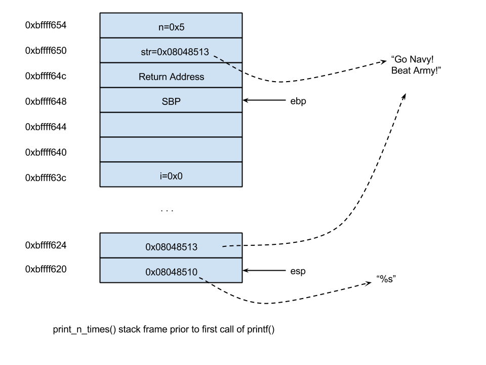

# Unit 2: Reverse Engineering Binary Programs

# Understanding a Binary Program

## A binary program ... what is it?

In the last unit we looked a lot at writing programs in c, compiling
them into binaries, and then running them. In this unit, we peal back
the covers further and look right at the binary files themselves. We
will examine both what exactly is a binary, how is it formatted, and how
do we parse or dissemble the contents within?

## `objdump` and `readelf` basics

For this entire class, we will pick apart a simple helloworld program:

``` c
/*helloworld.c*/
#include <stdio.h>

void printhello(){

  char hello[15]="Hello, World!\n";
  char * p;

  for(p = hello; *p; p++){

    putchar(*p);

  }

}

int main(){

  printhello();

  return 0;
}
}
```

Let's compile the program to create a binary (but with a bunch of
options to make it easier for us):

``` example
$ gcc -fno-stack-protector -z execstack -Wno-format-security -O0 -g    helloworld.c   -o helloworld
```

Now if we use the `file` command we can see what kind of file the binary
is.

``` example
$ file helloworld
helloworld: ELF 32-bit LSB executable, Intel 80386, version 1 (SYSV), dynamically linked, interpreter /lib/ld-linux.so.2, for GNU/Linux 2.6.32, BuildID[sha1]=2653c851c192779ec91599dc79d28f98bdf66bb4, not stripped
```

We see that it is actually an `ELF` file, which stands for Executable
and Linkable Format. We will work exclusively with binaries in ELF.

### ELF Files and ELF Headers

All ELF files have a header describing the different sections and
general information. We can read the header information for our
`helloworld` program using the `readelf`

``` example
$ readelf -h helloworld
ELF Header:
  Magic:   7f 45 4c 46 01 01 01 00 00 00 00 00 00 00 00 00 
  Class:                             ELF32
  Data:                              2's complement, little endian
  Version:                           1 (current)
  OS/ABI:                            UNIX - System V
  ABI Version:                       0
  Type:                              EXEC (Executable file)
  Machine:                           Intel 80386
  Version:                           0x1
  Entry point address:               0x8048310
  Start of program headers:          52 (bytes into file)
  Start of section headers:          7028 (bytes into file)
  Flags:                             0x0
  Size of this header:               52 (bytes)
  Size of program headers:           32 (bytes)
  Number of program headers:         9
  Size of section headers:           40 (bytes)
  Number of section headers:         36
  Section header string table index: 33
```

Most of this information isn't too useful, but let me point out some key
things.

1.  There is a magic number! The magic number is used to say, hey this
    is ELF and what version
2.  The class is ELF32, so it's 32 bit
3.  The machine is Intel 80386, or x386 to be expected
4.  The entry point for the file is address 0x8048310, essentially what
    is the first instruction in the \_<sub>start</sub> section function
    which calls main.

Everything else is not super useful for our purposes. Another nice thing
we can do with `readelf` is we can look at all the sections, which is
regions of the binary for different purposes.

``` example
$ readelf -S helloworld
There are 35 section headers, starting at offset 0x2070:

Section Headers:
  [Nr] Name              Type            Addr     Off    Size   ES Flg Lk Inf Al
  [ 0]                   NULL            00000000 000000 000000 00      0   0  0
  [ 1] .interp           PROGBITS        08048154 000154 000013 00   A  0   0  1
  [ 2] .note.ABI-tag     NOTE            08048168 000168 000020 00   A  0   0  4
  [ 3] .note.gnu.build-i NOTE            08048188 000188 000024 00   A  0   0  4
  [ 4] .gnu.hash         GNU_HASH        080481ac 0001ac 000020 04   A  5   0  4
  [ 5] .dynsym           DYNSYM          080481cc 0001cc 000050 10   A  6   1  4
  [ 6] .dynstr           STRTAB          0804821c 00021c 00004d 00   A  0   0  1
  [ 7] .gnu.version      VERSYM          0804826a 00026a 00000a 02   A  5   0  2
  [ 8] .gnu.version_r    VERNEED         08048274 000274 000020 00   A  6   1  4
  [ 9] .rel.dyn          REL             08048294 000294 000008 08   A  5   0  4
  [10] .rel.plt          REL             0804829c 00029c 000010 08  AI  5  23  4
  [11] .init             PROGBITS        080482ac 0002ac 000023 00  AX  0   0  4
  [12] .plt              PROGBITS        080482d0 0002d0 000030 04  AX  0   0 16
  [13] .plt.got          PROGBITS        08048300 000300 000008 08  AX  0   0  8
  [14] .text             PROGBITS        08048310 000310 000212 00  AX  0   0 16
  [15] .fini             PROGBITS        08048524 000524 000014 00  AX  0   0  4
  [16] .rodata           PROGBITS        08048538 000538 000008 00   A  0   0  4
  [17] .eh_frame_hdr     PROGBITS        08048540 000540 00004c 00   A  0   0  4
  [18] .eh_frame         PROGBITS        0804858c 00058c 00012c 00   A  0   0  4
  [19] .init_array       INIT_ARRAY      08049f0c 000f0c 000004 04  WA  0   0  4
  [20] .fini_array       FINI_ARRAY      08049f10 000f10 000004 04  WA  0   0  4
  [21] .dynamic          DYNAMIC         08049f14 000f14 0000e8 08  WA  6   0  4
  [22] .got              PROGBITS        08049ffc 000ffc 000004 04  WA  0   0  4
  [23] .got.plt          PROGBITS        0804a000 001000 000014 04  WA  0   0  4
  [24] .data             PROGBITS        0804a014 001014 000008 00  WA  0   0  4
  [25] .bss              NOBITS          0804a01c 00101c 000004 00  WA  0   0  1
  [26] .comment          PROGBITS        00000000 00101c 000024 01  MS  0   0  1
  [27] .debug_aranges    PROGBITS        00000000 001040 000020 00      0   0  1
  [28] .debug_info       PROGBITS        00000000 001060 000389 00      0   0  1
  [29] .debug_abbrev     PROGBITS        00000000 0013e9 000130 00      0   0  1
  [30] .debug_line       PROGBITS        00000000 001519 0000dc 00      0   0  1
  [31] .debug_str        PROGBITS        00000000 0015f5 0002bd 01  MS  0   0  1
  [32] .symtab           SYMTAB          00000000 0018b4 000470 10     33  49  4
  [33] .strtab           STRTAB          00000000 001d24 000206 00      0   0  1
  [34] .shstrtab         STRTAB          00000000 001f2a 000145 00      0   0  1
Key to Flags:
  W (write), A (alloc), X (execute), M (merge), S (strings), I (info),
  L (link order), O (extra OS processing required), G (group), T (TLS),
  C (compressed), x (unknown), o (OS specific), E (exclude),
  p (processor specific)
```

Again, a bunch of this information isn't too useful for us, but might be
later. Some key things to look at:

1.  The `.bss` section is listed, this is the same as bss in the program
    memory layout
2.  There is also .data section, same as the program memory layout
3.  Finally, there is a .text section, same as before. And notice that
    it is at address 0x08048370 which is the same address in the header
    to the start of the program instructions.

### Getting at the assembly with `objdump`

Now that we have some idea of the how the file is formatted, it would be
nice to get down into the details of the machine instructions
themselves. For this, we'll use `objdump` or "object dump". Simply, we
can call it on the binary executable like so:

``` example
$ objdump -d helloworld   

helloworld:     file format elf32-i386


Disassembly of section .init:

080482ac <_init>:
 80482ac:	53                   	push   %ebx
 80482ad:	83 ec 08             	sub    $0x8,%esp
 80482b0:	e8 ab 00 00 00       	call   8048360 <__x86.get_pc_thunk.bx>
 80482b5:	81 c3 4b 1d 00 00    	add    $0x1d4b,%ebx
 80482bb:	8b 83 fc ff ff ff    	mov    -0x4(%ebx),%eax
 80482c1:	85 c0                	test   %eax,%eax
 80482c3:	74 05                	je     80482ca <_init+0x1e>
 80482c5:	e8 36 00 00 00       	call   8048300 <__gmon_start__@plt>
 80482ca:	83 c4 08             	add    $0x8,%esp
 80482cd:	5b                   	pop    %ebx
 80482ce:	c3                   	ret    

    ...
```

It's going to dump a lot of stuff, but lets look more carefully down,
we'll see one header that looks familiar `main()` and `printhello()`:

``` example
08048426 <printhello>:
 8048426:	55                   	push   %ebp
 8048427:	89 e5                	mov    %esp,%ebp
 8048429:	53                   	push   %ebx
 804842a:	83 ec 24             	sub    $0x24,%esp
 804842d:	e8 2e ff ff ff       	call   8048360 <__x86.get_pc_thunk.bx>
 8048432:	81 c3 ce 1b 00 00    	add    $0x1bce,%ebx
 8048438:	c7 45 e5 48 65 6c 6c 	movl   $0x6c6c6548,-0x1b(%ebp)
 804843f:	c7 45 e9 6f 2c 20 57 	movl   $0x57202c6f,-0x17(%ebp)
 8048446:	c7 45 ed 6f 72 6c 64 	movl   $0x646c726f,-0x13(%ebp)
 804844d:	66 c7 45 f1 21 0a    	movw   $0xa21,-0xf(%ebp)
 8048453:	c6 45 f3 00          	movb   $0x0,-0xd(%ebp)
 8048457:	8d 45 e5             	lea    -0x1b(%ebp),%eax
 804845a:	89 45 f4             	mov    %eax,-0xc(%ebp)
 804845d:	eb 19                	jmp    8048478 <printhello+0x52>
 804845f:	8b 45 f4             	mov    -0xc(%ebp),%eax
 8048462:	0f b6 00             	movzbl (%eax),%eax
 8048465:	0f be c0             	movsbl %al,%eax
 8048468:	83 ec 0c             	sub    $0xc,%esp
 804846b:	50                   	push   %eax
 804846c:	e8 7f fe ff ff       	call   80482f0 <putchar@plt>
 8048471:	83 c4 10             	add    $0x10,%esp
 8048474:	83 45 f4 01          	addl   $0x1,-0xc(%ebp)
 8048478:	8b 45 f4             	mov    -0xc(%ebp),%eax
 804847b:	0f b6 00             	movzbl (%eax),%eax
 804847e:	84 c0                	test   %al,%al
 8048480:	75 dd                	jne    804845f <printhello+0x39>
 8048482:	90                   	nop
 8048483:	8b 5d fc             	mov    -0x4(%ebp),%ebx
 8048486:	c9                   	leave  
 8048487:	c3                   	ret    

08048488 <main>:
 8048488:	8d 4c 24 04          	lea    0x4(%esp),%ecx
 804848c:	83 e4 f0             	and    $0xfffffff0,%esp
 804848f:	ff 71 fc             	pushl  -0x4(%ecx)
 8048492:	55                   	push   %ebp
 8048493:	89 e5                	mov    %esp,%ebp
 8048495:	51                   	push   %ecx
 8048496:	83 ec 04             	sub    $0x4,%esp
 8048499:	e8 18 00 00 00       	call   80484b6 <__x86.get_pc_thunk.ax>
 804849e:	05 62 1b 00 00       	add    $0x1b62,%eax
 80484a3:	e8 7e ff ff ff       	call   8048426 <printhello>
 80484a8:	b8 00 00 00 00       	mov    $0x0,%eax
 80484ad:	83 c4 04             	add    $0x4,%esp
 80484b0:	59                   	pop    %ecx
 80484b1:	5d                   	pop    %ebp
 80484b2:	8d 61 fc             	lea    -0x4(%ecx),%esp
 80484b5:	c3                   	ret    
```

This is the assembly for the main function. Looking across, from left to
right, the furthest left is the address this instruction is loaded
into, then the actually bytes of the instruction, and then finally the
name of the details of the instruction.

The first thing you might notice about the instruction itself is that it
is really, really hard to read. That's because it is AT&T syntax, which,
simply, sucks! We will use an alternative format called Intel syntax,
which is much, much nicer. For that, we need to pass an argument to
`objdump`:

``` example
user@si485H-base:demo$ objdump -M intel -d helloworld 

(... snip ...)

08048426 <printhello>:
 8048426:	55                   	push   ebp
 8048427:	89 e5                	mov    ebp,esp
 8048429:	53                   	push   ebx
 804842a:	83 ec 24             	sub    esp,0x24
 804842d:	e8 2e ff ff ff       	call   8048360 <__x86.get_pc_thunk.bx>
 8048432:	81 c3 ce 1b 00 00    	add    ebx,0x1bce
 8048438:	c7 45 e5 48 65 6c 6c 	mov    DWORD PTR [ebp-0x1b],0x6c6c6548
 804843f:	c7 45 e9 6f 2c 20 57 	mov    DWORD PTR [ebp-0x17],0x57202c6f
 8048446:	c7 45 ed 6f 72 6c 64 	mov    DWORD PTR [ebp-0x13],0x646c726f
 804844d:	66 c7 45 f1 21 0a    	mov    WORD PTR [ebp-0xf],0xa21
 8048453:	c6 45 f3 00          	mov    BYTE PTR [ebp-0xd],0x0
 8048457:	8d 45 e5             	lea    eax,[ebp-0x1b]
 804845a:	89 45 f4             	mov    DWORD PTR [ebp-0xc],eax
 804845d:	eb 19                	jmp    8048478 <printhello+0x52>
 804845f:	8b 45 f4             	mov    eax,DWORD PTR [ebp-0xc]
 8048462:	0f b6 00             	movzx  eax,BYTE PTR [eax]
 8048465:	0f be c0             	movsx  eax,al
 8048468:	83 ec 0c             	sub    esp,0xc
 804846b:	50                   	push   eax
 804846c:	e8 7f fe ff ff       	call   80482f0 <putchar@plt>
 8048471:	83 c4 10             	add    esp,0x10
 8048474:	83 45 f4 01          	add    DWORD PTR [ebp-0xc],0x1
 8048478:	8b 45 f4             	mov    eax,DWORD PTR [ebp-0xc]
 804847b:	0f b6 00             	movzx  eax,BYTE PTR [eax]
 804847e:	84 c0                	test   al,al
 8048480:	75 dd                	jne    804845f <printhello+0x39>
 8048482:	90                   	nop
 8048483:	8b 5d fc             	mov    ebx,DWORD PTR [ebp-0x4]
 8048486:	c9                   	leave  
 8048487:	c3                   	ret    

08048488 <main>:
 8048488:	8d 4c 24 04          	lea    ecx,[esp+0x4]
 804848c:	83 e4 f0             	and    esp,0xfffffff0
 804848f:	ff 71 fc             	push   DWORD PTR [ecx-0x4]
 8048492:	55                   	push   ebp
 8048493:	89 e5                	mov    ebp,esp
 8048495:	51                   	push   ecx
 8048496:	83 ec 04             	sub    esp,0x4
 8048499:	e8 18 00 00 00       	call   80484b6 <__x86.get_pc_thunk.ax>
 804849e:	05 62 1b 00 00       	add    eax,0x1b62
 80484a3:	e8 7e ff ff ff       	call   8048426 <printhello>
 80484a8:	b8 00 00 00 00       	mov    eax,0x0
 80484ad:	83 c4 04             	add    esp,0x4
 80484b0:	59                   	pop    ecx
 80484b1:	5d                   	pop    ebp
 80484b2:	8d 61 fc             	lea    esp,[ecx-0x4]
 80484b5:	c3                   	ret    
 
 (... snip ...)
```

### Disassembling with `gdb`

Another way to get the disassembly code is using `gdb`, the gnu debugger,
which also does a tone of other tasks which we will look at later. To
start, run the program under the debugger:

``` example
$ gdb helloworld 
GNU gdb (Ubuntu 8.1-0ubuntu3) 8.1.0.20180409-git
Copyright (C) 2018 Free Software Foundation, Inc.
License GPLv3+: GNU GPL version 3 or later <http://gnu.org/licenses/gpl.html>
This is free software: you are free to change and redistribute it.
There is NO WARRANTY, to the extent permitted by law.  Type "show copying"
and "show warranty" for details.
This GDB was configured as "x86_64-linux-gnu".
Type "show configuration" for configuration details.
For bug reporting instructions, please see:
<http://www.gnu.org/software/gdb/bugs/>.
Find the GDB manual and other documentation resources online at:
<http://www.gnu.org/software/gdb/documentation/>.
For help, type "help".
Type "apropos word" to search for commands related to "word"...
Reading symbols from helloworld...done.
(gdb) ds printhello
Dump of assembler code for function printhello:
   0x08048426 <+0>:	push   ebp
   0x08048427 <+1>:	mov    ebp,esp
   0x08048429 <+3>:	push   ebx
   0x0804842a <+4>:	sub    esp,0x24
   0x0804842d <+7>:	call   0x8048360 <__x86.get_pc_thunk.bx>
   0x08048432 <+12>:	add    ebx,0x1bce
   0x08048438 <+18>:	mov    DWORD PTR [ebp-0x1b],0x6c6c6548
   0x0804843f <+25>:	mov    DWORD PTR [ebp-0x17],0x57202c6f
   0x08048446 <+32>:	mov    DWORD PTR [ebp-0x13],0x646c726f
   0x0804844d <+39>:	mov    WORD PTR [ebp-0xf],0xa21
   0x08048453 <+45>:	mov    BYTE PTR [ebp-0xd],0x0
   0x08048457 <+49>:	lea    eax,[ebp-0x1b]
   0x0804845a <+52>:	mov    DWORD PTR [ebp-0xc],eax
   0x0804845d <+55>:	jmp    0x8048478 <printhello+82>
   0x0804845f <+57>:	mov    eax,DWORD PTR [ebp-0xc]
   0x08048462 <+60>:	movzx  eax,BYTE PTR [eax]
   0x08048465 <+63>:	movsx  eax,al
   0x08048468 <+66>:	sub    esp,0xc
   0x0804846b <+69>:	push   eax
   0x0804846c <+70>:	call   0x80482f0 <putchar@plt>
   0x08048471 <+75>:	add    esp,0x10
   0x08048474 <+78>:	add    DWORD PTR [ebp-0xc],0x1
   0x08048478 <+82>:	mov    eax,DWORD PTR [ebp-0xc]
   0x0804847b <+85>:	movzx  eax,BYTE PTR [eax]
   0x0804847e <+88>:	test   al,al
   0x08048480 <+90>:	jne    0x804845f <printhello+57>
   0x08048482 <+92>:	nop
   0x08048483 <+93>:	mov    ebx,DWORD PTR [ebp-0x4]
   0x08048486 <+96>:	leave  
   0x08048487 <+97>:	ret    
End of assembler dump.
(gdb) ds main
Dump of assembler code for function main:
   0x08048488 <+0>:	lea    ecx,[esp+0x4]
   0x0804848c <+4>:	and    esp,0xfffffff0
   0x0804848f <+7>:	push   DWORD PTR [ecx-0x4]
   0x08048492 <+10>:	push   ebp
   0x08048493 <+11>:	mov    ebp,esp
   0x08048495 <+13>:	push   ecx
   0x08048496 <+14>:	sub    esp,0x4
   0x08048499 <+17>:	call   0x80484b6 <__x86.get_pc_thunk.ax>
   0x0804849e <+22>:	add    eax,0x1b62
   0x080484a3 <+27>:	call   0x8048426 <printhello>
   0x080484a8 <+32>:	mov    eax,0x0
   0x080484ad <+37>:	add    esp,0x4
   0x080484b0 <+40>:	pop    ecx
   0x080484b1 <+41>:	pop    ebp
   0x080484b2 <+42>:	lea    esp,[ecx-0x4]
   0x080484b5 <+45>:	ret    
End of assembler dump.

```

This will print out a disclaimer and leave you in a gdb terminal. Now,
you can type `disassemble <func name>main` to disassemble the main
function. If you set up the alias already as suggested in the resource
page, you can shorten that to `ds` for disassemble.

If your output is in AT&T syntax, then issue the command:

``` example
(gdb) set disassembly-flavor intel
```

To have gdb output in Intel syntax.

I'll mostly work with gdb dissambled output because it's more nicely
formatted, IMHO. Our next task is understanding what the hell is going
on?!?!

## x86 the Processor Register State

### x86 Instruction Set

Let's start with a simple item, what is x86? It is an assembly
instruction set -- a programming language. We can repressed x86 terms of
it's byte (as seen in the objdump output) or in a human readable form
(as seen in the Intel or AT&T) syntax.

You may have worked with an instruction set previously, such as MIPS.
MIPS has the property that it is a RISC instrument set, or a Reduce
Instruction Set Computing, which has the advantage that all instructions
and arguments are always the same size, 32 bits.

x86 is a CISC instruction set, or Complex Instruction Set Computing, and
it has the property that instruction sizes are not contest. They can
very between 8 bits and 64 bits and more, depending on the instruction.
You may wonder, why in the world would anything be designed this way?
The answer is market inertia and backwards capability. As Intel chips
dominated the market, more and more binary was x86.

Today, another instruction set has become very relevant: ARM or Acron
Risc Machine. And, as the name indicates, it is a RISC instruction set
and thus is bringing back a bit of sanity to the instruction set world.
ARM is also the architecture of choice on many mobile devices, so it
will be relevant for quite some time.

However, we will not be working with ARM in this class, just x86, and we
will only be using a very small set of the x86 instructions. You can
read more about x86 in the extensive online resources, and when we
encounter an unfamiliar instruction, we will look it up.

### Anatomy of an Instruction

An instruction, in the human readable format, has the following format:

``` example
operation <dst>, <src>
```

The operation name is the kind of operation that will be performed. For
example, it could be an `add` or `mov` or `and`. The `<dst>` is where
the result will be stored, which is typically a register. The `<src>` is
from where the data is read to be operated over which might also include
data referenced in the `<dst>`. The `<src>` is optional, and depends on
the command.

If we take a few operations from our sample code:

``` example
   0x0804841d <+0>: push   ebp
   0x0804841e <+1>: mov    ebp,esp
   0x08048420 <+3>: and    esp,0xfffffff0
```

The first command `push` takes one argument an places that argument on
the stack, adjusting the stack pointer. In this case, it pushes the
value of the base pointer stored in the register `ebp` onto the stack.
The second command, `mov` takes two arguments, and will *move* a value
from one location to another, much like assignment. The second command
moves the value in the stack pointer `esp` and saves it in the base
pointer `ebp`. Finally, the last command is a bitwise and operation
taking two arguments. It will perform a bitwise and on the `<dst>` with
the `<src>` and store the result in `<dst>`. In this context, the `and`
command aligns the stack pointer with the lowest 4-bit value. The 4-bit
alignment is due to an old bug in the division unit of the x86
processor, and so you'll see this sequence a lot in assembly.

We will take a closer look at these instructions again in a second, but
before we do that, we need to understand these registers and what they
are used for in more detail.

### Processor Registers

Registers are special storage spaces on the processor that store the
state of the program. Some registers are used for general purpose
storage to store intermediate storage, while others are used to keep
track of the execution state, e.g., like what is the next instruction.

Here are the standard registers you will encounter. There are some
others, but we'll explain them when we come across them:

-   `esp`: 32-bit register to store the stack pointer
-   `ebp`: 32-bit register to store the base pointer
-   `eax`: 32-bit general purpose register, sometimes called the
    "accumulator"
-   `ecx`: 32-bit general purpose register
-   `ebx`: 32-bit general purpose register
-   `edx`: 32-bit general purpose register
-   `esi`: 32-bit general purpose registers mostly used for loading and
    storing
-   `edi`: 32-bit general purpose registers mostly used for loading and
    storing

Each of the general purpose registers can be referenced either by there
full 32-bit value or by some subset of that, such as the first 8 bits or
second 8 bits. For example, `eax` refers to the 32-bit general
registers, but `ax` refers to the last 16 bits of the `eax` register and
`al` is the first 8 bits. Depending on the kind of data the register is
storing, we may reference different parts.

[](imgs/x86-registers.png)

### The Base Pointer and Stack Pointer

Two registers will be referenced more than any other: the base and stack
pointer. These registers maintain the memory reference state for the
current execution, with reference to the current function frame. A
function frame is portion of memory on the stack that stores the
information for a current functions execution, including local data and
return addresses. The base pointer define the top and bottom of the
function frame.

The structure of a function frame is like such

``` example
           <- 4 bytes ->
          .-------------.    
          |    ...      |    higher address
ebp+0x8 ->| func args   |
ebp+0x4 ->| return addr |       
    ebp ->| saved ebp   |
ebp-0x4 ->|             |
   :      :             :              
   '      '             '
            local args
   .      .             .
   :      :             :
esp+0x4 ->|             |
    esp ->|             |    lower addreses
          '-------------'
```

Moving from higher addresses to lower addresses, the top of the frame
stores the function arguments. These are typically referenced in
positive offsets of `ebp` register. For example, the first argument is
at `ebp+0x8` moving upwards from there.

The second item in the function frame is the return address at
`ebp+0x4`. The value stored in this memory is where the next instruction
is after the return statement, or what instruction occurs after the call
to this insturction completes. We will spend a LOT OF TIME talking about
this later.

Finally, there is the saved `ebp`, this is the address where the last
base pointer for the calling function. We need to save this value so
that the calling function's stack frame can be restored onced this
function completes.

The stack pointer references the bottom of the stack, the lowest address
allocated. Addresses past this point are considered un-allocated.
However, it's pretty easy to allocate more space, we'll just subtract
from the stack pointer.

# Stack Frame Management and Assembly

## Stack Frames

The stack frame is an encapsulation of the local memory state for a
function call. It has information about the local variables of the
function as well as to which function (or specifically which instruction
address) to jump to once this function returns.

A stack frame is managed by two registers: ebp and esp. The ebp
register, or base pointer, is at the top of the stack frame (higher
addresses) and the esp regiser, or stack pointer, is at the bototm of
the stack frame (lower addresses). To make this even more confusing, we
sometimes refer to the esp being the "top of the stack," but it is
really the bottom since it is in lower address space.

When we do memory references within a function, we are almost always
describing the address of that memory as a positive or negative offset
of esp or ebp.

For example, a typical stack frame looks like so:

``` example
           <- 4 bytes ->
          .-------------.    
          |    ...      |    higher address
ebp+0x8 ->| func args   |
ebp+0x4 ->| return addr |       
    ebp ->| saved ebp   |
ebp-0x4 ->|             |
   :      :             :              
   '      '             '
            local vars
   .      .             .
   :      :             :
esp+0x4 ->|             |
    esp ->|             |    lower addreses
          '-------------'
```

The base pointer always references the saved based pointer of the
calling function (more on that soon), and above that (in higher address)
is the return address and the arguments to the function.

## Stack Machines

We often describe x86 processors as stack machines. The reason for this
is that the execution model is built around a stack. As functions are
called, there infomration is pushed on to the stack, and as functions
return, they are popped off of the stack.

For example, in this code:

``` c

int foo(){
  bar();
  baz();
}


int main(){
  return foo();
}
```

In the stack machine model, the first calling function is pushed on the
stack, namely `main`. Since `main` calls `foo`, we push `foo` onto the
stack next. Now we have something that looks like this:

``` example

   .------.
   | main |
   | foo  |
```

Since foo calls `bar` before it can return, `bar` is pushed on the
stack.

``` example

   .------.
   | main |
   | foo  |
   | bar  |
```

Once `bar` returns, `foo` still can't return since `baz` needs to be
called and is pushed on the stack.

``` example

   .------.
   | main |
   | foo  |
   | baz  |
```

At this point, it is important to note that the entire state of
functions ot complete, `main` and `foo`, have not been forgotten. They
are still there. Once `baz` returns and is poped, `foo` can return and
be popped, and finally, `main` returns and is popped.

This stack-based model of execution is directly applied in the function
stack in memory. Each function is described as a stack frame, and each
stack frame has a link back to the previous stack frame execution
reference (the return address) and alignment information (the saved base
pointer). As functions are called and completed, their stack frames are
pushed and popped off the stack accordingly, but this doesn't happen
automatically. There needs to be explicit instructions to do that, and
that is what we'll look at next.

## Allocating a new stack frame

The first set of instructions in our main function is for managing the
stack frame for the current function. In our code, this looks like this:

``` example
 0x08048426 <+0>:	push   ebp
 0x08048427 <+1>:	mov    ebp,esp
 0x08048429 <+3>:	push   ebx
 0x0804842a <+4>:	sub    esp,0x24
```

Let's first analyze the first four instructions. The push instruction
will push a value onto the stack, and in this case it is the previous
base pointer, ie, the saved based pointer. Next, the base pointer is set
to the stack pointer (`mov`). Next, subtracting from the stack pointer
allocates the rest of the stack frame, which is 0x24 bytes long or 36
bytes (don't forget about hex).

The need for these instructions is so that the previous stack frame, the
calling function's stack frame, can be reconstructed. To understand
this, recall the layout of a function's stack frame. The `ebp` register
references the saved value for the base pointer of the calling stack.
Once the function returns, memory is deallocated by adjusting the stack
pointer to the current base pointer; setting the base pointer to the
saved base pointer; and then performing a *leave* by popping off the
saved base pointer and return address, setting the current instruction
pointer to the return address.

Visually the frame construction looks like this:

``` example

    (0) calling         (1) return addr of      (2) push ebp
        function's          calling function   
        stack frame         pushed onto stack

     .-------------.       .-------------.      .-------------.       
     |    ...      |       |    ...      |      |    ...      |  
ebp->|             |  ebp->|             | ebp->|             |
     :             :       :             :      :             :
         calling              calling             calling
     :   stack     :       :   stack     :      :   stack     :
     |   frame     |       |   frame     |      |   frame     |
     |             |       |             |      |             |
esp->|  func args  |       |  func args  |      |  func args  |   
     '-------------'  esp->|  return adr |      |  return adr |
                           '-------------' esp->|  saved ebp  |
                                                '-------------'


       (3) mov ebp,esp         (4) sub esp,0x24

         .-------------.        .-------------.       
         |    ...      |        |    ...      |   
         |             |        |             |  
         :             :        :             :  
            calling                 calling    
         :   stack     :        :   stack     :
         |   frame     |        |   frame     |
         |             |        |             |
         |  func args  |        |  func args  |
         |  retur adr |         |  retur adr  |
esp,ebp->|  saved ebp  |    bp->|  saved ebp  |
         '-------------'        |             |
                                :             :
                                      New 
                                :   stack     :
                           esp->|      Frame  |
                                '-------------'
```

## The `__x86.get_pc_thunk` functions

You may have noticed that in the disassembled x86 for both `main` and
`printhello` is two extra function calls, `__x86.get_pc_thunk.bx` and
`__x86.get_pc_thunk.ax`. These two functions are added by the compiler to load
the address of the *next* instruction into the `bx` and `ax` portion of the
register, respectively. The `add` that follows clears out the lower `bh/bl` and
`ah/al` portion of the registers, so the two work in combination.

Why is this useful? Well, it isn't, at least, not for our programs. This is used
for handling position independent compilation, which is necessary for dynamic
libraries. The ability to load certain program-counter points comes more
naturally in x86_64, but since we are compiling 32-bit on a 64-bit machine
(e.g., the `-m32` and `-no-pie` option to compilation), `gcc` goes ahead and adds in these
functions where needed. They have no real effect on the 32-bit programs we are
analyzing, so you can essentially ignore them.

However, if you're curious how it works, you can use `gdb` to print the
instructions:

``` example

(gdb) x/2i 0x8048360
   0x8048360 <__x86.get_pc_thunk.bx>:	mov    ebx,DWORD PTR [esp]
   0x8048363 <__x86.get_pc_thunk.bx+3>:	ret 
```

Since we reached the function via a `call`, the return address is pushed onto
the stack. `esp` is reference that return address. The `mov` instruction, along
with the deference of `DWORD PTR [esp]`, saves the return address into the `ebx`
register. This way of quickly saving an address actually will come in handy
later when we start writing shell code.

Finally, the `mov` instruction at the end of the `printhello` instruction is
also connected to this compiler addition. Since the instruction of the start of
the function is loaded into `ebx`, it places the return address of the function
`printhello` stored at `ebp-0x4`. This, again, is to track execution to enable
position independent code. You can mostly ignore these extra instructions, but
be careful to verify first that it is not effecting the normal operations of the
program you are analyzing.

## De-allocating a stack frame

Now that a new stack frame construction is complete, we can jump to the end and
look at what happens once the function returns. How is the stack frame
deallocated and popped off the stack.

Two instructions manage that process.

``` example
 0x08048486 <+96>:	leave  
 0x08048487 <+97>:	ret   
```

First the `leave` instruction will do two things:

1.  `mov esp,ebp` : set the stack pointer to the base pointer, essential
    deallocating the local variables in the function
2.  `pop ebp` : after the move, the top of the stack is the saved base
    pointer, so by poping the value at the top of the stack into ebp, we
    are reseting the base pointer to the saved one.

Visually this would look like this:

``` example
                              leave                  leave
                              1. =mov esp,ebp=       2. pop ebp
      .-------------.          .-------------.      .-------------.   
      |    ...      |          |     ...     | ebp->|    ...      |
      |             |          |             |      |             |
      :             :          :             :      :             :
        calling                  calling               calling
      :   stack     :          :  stack      :      :  stack      :
      |   frame     |          |  frame      |      |  frame      |
      |             |          |             |      |
      |  func args  |          |  func args  |      |  func args  |
      |  retur val  |          |  return adr | esp->|  return adr |
 ebp->|  saved ebp  | ebp,esp->| saved ebp   |      '-------------'
      |             |          '-------------'
      :             :
            New 
      :   stack     :
 esp->|      Frame  |
      '-------------'
```

At this point the stack is almost back to its state prior to the
function call. The last thing to do is to pop off the return value and
set the instruction pointer (i.e., the current execution point) to the
return value. Conceptually, we can see that `ret` does both those in two
steps:

1.  `pop eip` : pop the return value and set it to the instruction
    pointer
2.  `jmp eip` : move execution to the instruction pointer

In reality, these procedures happen at the same time since setting the
eip is the same as jumping, but it's good to think of them as separate
steps.

``` example
                             ret                  ret 
                            1. pop eip          2. jmp eip
      .-------------.      .-------------.     
ebp-> |    ...      | ebp->|      ...    |        Execution
      :             :      :             :        returns to calling 
         calling            calling               function after the call
      :  stack      :      : stack       :        with stack frame reset
      |  frame      |      | frame       |
      |             |      |             |
      |  func args  | esp->| func args   |
esp-> | return adr  |      '-------------'
      '-------------'
```

# Memory References, Jumps/Loops, and Function Calls

## Referencing, De-Referencing, and Setting Memory

The next set of instructions we will observe initializes the memory of
the stack. Let's switch back to the C-code to see this in c first before
we look at it in assembly.

``` c
    char hello[15]="Hello, World!\n";
```

The string "Hello World!\\n" is set on the stack in 15 byte character
array. In assembly, this looks like this.

``` example
 0x08048438 <+18>:	mov    DWORD PTR [ebp-0x1b],0x6c6c6548
 0x0804843f <+25>:	mov    DWORD PTR [ebp-0x17],0x57202c6f
 0x08048446 <+32>:	mov    DWORD PTR [ebp-0x13],0x646c726f
 0x0804844d <+39>:	mov    WORD PTR [ebp-0xf],0xa21
 0x08048453 <+45>:	mov    BYTE PTR [ebp-0xd],0x0
```

If you squint at the `<src>` of the operators, you'll recognize that
this is ASCII. If you don't believe me, check out the ASCII table. The
DWORD or WORD or BYTE PTR are deference commands.

-   `BYTE PTR[addr]` : byte-pointer : de-reference one byte at the
    address
-   `WORD PTR[addr]` : word-pointer : de-reference the two bytes at the
    address
-   `DWORD PTR[addr]` : double word-pointer : de-reference the four
    bytes at the address

Another way to look at these instructions in C would be like this (don't
program like this, though):

``` c
  char hello[15];
  //                      l l e H  
  * ((int *) (hello)) = 0x6c6c6548;      // set hello[0]->hello[3]
  //                          W   , o
  * ((int *) (hello + 4)) = 0x57202c6f; // set hello[4]->hello[7]
  //                          d l r o      
  * ((int *) (hello + 8)) = 0x646c726f; // set hello[8]->hello[11]
  //                             \n !
  * ((short *) (hello + 12)) = 0x0a21;  // set hello[12]->hello[13]
  //                         \0
  * ((char *) (hello+14)) = 0x00;  // set hello[14]
```

The next two instructions are a bit different:

``` example
 0x08048457 <+49>:	lea    eax,[ebp-0x1b]
 0x0804845a <+52>:	mov    DWORD PTR [ebp-0xc],eax
```

=lea= stands for *load effective address* and is a short cut for to do a
bit a math and calculate a pointer offset and store it. If we look at
what's next in the C-program, we see that it is setting up the for-loop.

``` c
   for(p = hello; *p; p++){
```

The first part of the for loop is initializing the pointer `p` to
reference the start of the string `hello`. From the previous code, the
start of the string hello is at address offset `ebp-0x1b` and we want to
set that address to the value of `p`. This is a two step process:

1.  The actually address must be computed using addition from `esp` and
    stored. `lea eax,[ebp-0x1b]` will calculate the address and store it
    in `eax`.
2.  The value in `eax` must be stored in the memory reserved for `p`,
    which is at address `ebp-0xc`, the move command accomplishes that.

At this point, everything is set up. And for reference, remeber that the
address of `p` is at `ebp-0xc`.

## Loops, Jumps, and Condition Testing

Now, we've reached the meat of the program: the inner loop. We can
follow the execution at this point by following the jumps.

``` example
   0x0804845d <+55>:	jmp    0x8048478 <printhello+82>  # ------------.                          
   0x0804845f <+57>:	mov    eax,DWORD PTR [ebp-0xc]    # <------.    |                          
   0x08048462 <+60>:	movzx  eax,BYTE PTR [eax]         #        |    |                          
   0x08048465 <+63>:	movsx  eax,al                     #        |    |                          
   0x08048468 <+66>:	sub    esp,0xc                    #        |    |                          
   0x0804846b <+69>:	push   eax                        #        |    | //exit condition check   
   0x0804846c <+70>:	call   0x80482f0 <putchar@plt>    #        |    |                          
   0x08048471 <+75>:	add    esp,0x10                   #        |    |                          
   0x08048474 <+78>:	add    DWORD PTR [ebp-0xc],0x1    #        |    |                          
   0x08048478 <+82>:	mov    eax,DWORD PTR [ebp-0xc]    # <------+----'                          
   0x0804847b <+85>:	movzx  eax,BYTE PTR [eax]         #        | //loop body                   
   0x0804847e <+88>:	test   al,al                      #        |                               
   0x08048480 <+90>:	jne    0x804845f <printhello+57>  # -------'                               
```

A `jmp` instruction changes the instruction pointer to the destination
specified. It is not conditioned, it is explicit hard jump. Following
that jump in the code, we find the following three instructions which is
testing the exit condition from the loop.

``` example
  0x08048478 <+82>:	mov    eax,DWORD PTR [ebp-0xc]
  0x0804847b <+85>:	movzx  eax,BYTE PTR [eax]
  0x0804847e <+88>:	test   al,al
  0x08048480 <+90>:	jne    0x804845f <printhello+57>
```

Recall that `ebp-0xc` is the address of the pointer `p`, so doing
`DWORD PTR` will move into `eax` the memory reference stored in `p`. At
this point, `eax` stores the value of `p` which references some `char`
byte in the string, so we want to retrieve that `char` byte by
dereferencing `p` further, this time with a `BYTE PTR`.

The problem is, we just placed one byte into a 4-byte register that used
to have other bytes into it. We need to do some cleanup. 1The cleanup
operation is `movzx` instructions. The `movzx` instruction with the
`BYTE PTR` will *zero extend* the byte into `eax`. This means, that the
remaining 3 bytes of the register will be set to zero. At this point, we
have one byte snuggly stored in the `eax` register that is the `char`
referenced by `p`. We now need to check if that byte is NULL.

That test occurs `test al,al` which compares to registers in a number of
ways. Here we are testing the `al` register which is the lower 8-bits=
of `eax`, where we stored the deference of `p`. The results of the test,
greater then, less than, equal, not zero, etc. are stored in a set of
bit flags. The one we care about is the `ZF` flag or the *zero flag*. If
`al` is zero then `ZF` is set to 1 which would be the case when `p`
references the end of the `hello` string.

The `jne` command says to *jump when not equal to zero*. If it is the
case that `al` is zero, do not jump, otherwise continue to the address
and continue the loop.

## Function Calls

If we investigate the loop body, we find the following instructions:

``` example
   0x0804845f <+57>:	mov    eax,DWORD PTR [ebp-0xc]
   0x08048462 <+60>:	movzx  eax,BYTE PTR [eax]
   0x08048465 <+63>:	movsx  eax,al
   0x08048468 <+66>:	sub    esp,0xc
   0x0804846b <+69>:	push   eax
   0x0804846c <+70>:	call   0x80482f0 <putchar@plt>
   0x08048471 <+75>:	add    esp,0x10
```

The first set of instructions, much like the test before, is to
deference the pointer `p`.

1.  load the value of `p`, a memory address, into `eax`
2.  Read the byte referenced at `p` into the lower 8-bits of `eax`
3.  zero out the remaining bits of `eax` leaving only lower 8-bits

At this point, `eax` stores a value like 0x0000048 (i.e, 'H') where the
lowest byte is the character of interest, and the remaining bytes are 0.

The new instruction is `movsx`, which stands for sign extend. The two
previous operations placed a `char` into the `eax` register, but the
function we are about to call (`putchar()`) expects a signed integer. We
need to cast our one-byte signed value to a four-byte signed value. The
`movsx` operation takes the leading bit of the one-byte value, the sign
parity bit, and extends it to the front of the register where a 4-byte
signed value should be, thus completing the cast.

The next instruction should be familiar, it is a subtraction on the
stack pointer. This allocate space on the stack, providing us a location
to write the argument to the function we are about to call. We allocate
more space than we need in case the function does some stack
minipulation, and then we finally `push` our argument onto the stack.

The next operation is a `call` which will execute the function
`putchar`, conveniently told to us by gdb. Once that function completes,
execution will continue to the point right after the `call`, which is
the instruction `add esp,0x10`. This will deallocate the stack space we
allocate prior to the call.

The final instruction to consider is

``` example
    0x08048474 <+78>:	add    DWORD PTR [ebp-0xc],0x1
```

=p=, and the instructions following test weather `p` now references
zero. And the loop goes on to check the exit condition, which may jump
to do it all over again.

# Tracing a Program with `gdb`

## Compiling with Debug Symbols

To use GDB to its fullest, we want to include the debug flags during
compilation. This enable us to view the code along side the compilation
process. So far, we've just been looking at the binary, but we might
want to actually track the progress of a program line-by-line. Consider
first the simple program `datatype`:

``` c
#include <stdio.h>
#include <math.h>

int main(){

  char c;
  short s;
  int a,i;
  float f;
  double d;


  c = 'a';
  s = 0x1001;
  f = 3.1415926 ;
  d = exp(exp(1));

  for(i=0;i<10;i++){
    printf("i:%d c:%c s:%d f:%f d:%f\n",
    i,c,s,f,d);
  }

}
```

If we were to compile this program, we might do something like this:

``` example
gcc datatype.c -o datatype
```

Which gives us the executable binary datatype, and we can run it to
produce the expected output:

``` example
user@si485H-base:demo$ ./datatype 
i:0 c:a s:4097 f:3.141593 d:15.154262
i:1 c:a s:4097 f:3.141593 d:15.154262
i:2 c:a s:4097 f:3.141593 d:15.154262
i:3 c:a s:4097 f:3.141593 d:15.154262
i:4 c:a s:4097 f:3.141593 d:15.154262
i:5 c:a s:4097 f:3.141593 d:15.154262
i:6 c:a s:4097 f:3.141593 d:15.154262
i:7 c:a s:4097 f:3.141593 d:15.154262
i:8 c:a s:4097 f:3.141593 d:15.154262
i:9 c:a s:4097 f:3.141593 d:15.154262
```

We can also trace the program with gdb and take a look at the output
(the `-q` just suppreses the welcome message):

``` example
user@si485H-base:demo$ gdb -q ./datatype 
Reading symbols from ./datatype...(no debugging symbols found)...done.
(gdb) disassemble main
Dump of assembler code for function main:
   0x0804841d <+0>: push   ebp
   0x0804841e <+1>: mov    ebp,esp
   0x08048420 <+3>: and    esp,0xfffffff0
   0x08048423 <+6>: sub    esp,0x40
   0x08048426 <+9>: mov    BYTE PTR [esp+0x3b],0x61
   0x0804842b <+14>:    mov    WORD PTR [esp+0x38],0x1001
   0x08048432 <+21>:    mov    eax,ds:0x804854c
   0x08048437 <+26>:    mov    DWORD PTR [esp+0x34],eax
   0x0804843b <+30>:    fld    QWORD PTR ds:0x8048550
   0x08048441 <+36>:    fstp   QWORD PTR [esp+0x28]
   0x08048445 <+40>:    mov    DWORD PTR [esp+0x3c],0x0
   0x0804844d <+48>:    jmp    0x804848a <main+109>
   0x0804844f <+50>:    fld    DWORD PTR [esp+0x34]
   0x08048453 <+54>:    movsx  edx,WORD PTR [esp+0x38]
   0x08048458 <+59>:    movsx  eax,BYTE PTR [esp+0x3b]
   0x0804845d <+64>:    fld    QWORD PTR [esp+0x28]
   0x08048461 <+68>:    fstp   QWORD PTR [esp+0x18]
   0x08048465 <+72>:    fstp   QWORD PTR [esp+0x10]
   0x08048469 <+76>:    mov    DWORD PTR [esp+0xc],edx
   0x0804846d <+80>:    mov    DWORD PTR [esp+0x8],eax
   0x08048471 <+84>:    mov    eax,DWORD PTR [esp+0x3c]
   0x08048475 <+88>:    mov    DWORD PTR [esp+0x4],eax
   0x08048479 <+92>:    mov    DWORD PTR [esp],0x8048530
   0x08048480 <+99>:    call   0x80482f0 <printf@plt>
   0x08048485 <+104>:   add    DWORD PTR [esp+0x3c],0x1
   0x0804848a <+109>:   cmp    DWORD PTR [esp+0x3c],0x9
   0x0804848f <+114>:   jle    0x804844f <main+50>
   0x08048491 <+116>:   leave  
   0x08048492 <+117>:   ret    
End of assembler dump.
(gdb) 
```

But, if you look closely, you'll notice that we are missing the
debugging symbols, which further inform `gdb` about named values. This
means, line-by-line stepping of the program will not work. For example,
if I try and break at `main` and then take a step, it will fail because
gdb doesn't know what the next line of the source code is.

``` example
(gdb) br main
Breakpoint 1 at 0x8048420
(gdb) r
Starting program: /home/user/git/si485-binary-exploits/lec/04/demo/datatype 

Breakpoint 1, 0x08048420 in main ()
(gdb) n
Single stepping until exit from function main,
which has no line number information.
i:0 c:a s:4097 f:3.141593 d:15.154262
i:1 c:a s:4097 f:3.141593 d:15.154262
i:2 c:a s:4097 f:3.141593 d:15.154262
i:3 c:a s:4097 f:3.141593 d:15.154262
i:4 c:a s:4097 f:3.141593 d:15.154262
i:5 c:a s:4097 f:3.141593 d:15.154262
i:6 c:a s:4097 f:3.141593 d:15.154262
i:7 c:a s:4097 f:3.141593 d:15.154262
i:8 c:a s:4097 f:3.141593 d:15.154262
i:9 c:a s:4097 f:3.141593 d:15.154262
__libc_start_main (main=0x804841d <main>, argc=1, argv=0xbffff724, init=0x80484a0 <__libc_csu_init>, fini=0x8048510 <__libc_csu_fini>, rtld_fini=0xb7fed180 <_dl_fini>, 
    stack_end=0xbffff71c) at libc-start.c:321
321 libc-start.c: No such file or directory.
(gdb) 
```

All is not lost though, we can still work with just the binary without
the debug symbols, which is an embedding of the program source in the
binary. This is really important because for most of the programs we
want to analyze from a security perspective, we will not have access to
the debug symbols because most code is proprietary. It defeats the
purpose to release debug compiled versions.

However, this is a class where we are specifically trying to learn how
to use GDB for both line-by-line and also by instrction. We might as
well include the debug symbols ... for now. The gcc option to compile
with debug symbols is `-g`:

``` example
gcc -g datatype.c -o datatype
```

Now, when we run the program in `gdb` we can actually step through it:

``` example
user@si485H-base:demo$ gdb -q ./datatype 
Reading symbols from ./datatype...done.
(gdb) br main
Breakpoint 1 at 0x8048426: file datatype.c, line 15.
(gdb) r
Starting program: /home/user/git/si485-binary-exploits/lec/04/demo/datatype 

Breakpoint 1, main () at datatype.c:15
15    c = 'a';
(gdb) n
16    s = 0x1001;
(gdb) n
17    f = 3.1415926 ;
(gdb) n
18    d = exp(exp(1));
```

## Source code line-by-line debugging with `gdb`

Now that we have a compiled binary with debug symbols, we can explore
the process of line-by-line source code debugging. Here are the standard
commands for iterating through a program:

-   `break` or `br` or `b` *\<linenum|function|\*memaddress\>* : Set a
    break point where execution will halt at a given line number or
    function name. Additionally, we can set a break point at the memory
    address of an instruction.
-   `run` or `r` *\<args\>* : run the program with the command line
    arguments args.
-   `continue` or `c` *\<count\>* : continue the program until the next
    break point count times or program terminates
-   `next` or `n`: execute the next line of the program and **step
    over** function calls
-   `step` or `s`: execute the next line of the program and **step
    into** function calls
-   `finish` : finish the execution of the current function, or complete
    the current stack frame
-   `print` or `p` *\<var\>* : print the given variable and store the
    value in a gdb variable
-   `list` : display the current source code location

### Run, Continue and Next

Let's get our hands dirty and see some of these commands in action

``` example
$ gdb -q ./datatypes 
Reading symbols from ./datatypes...done.
(gdb) list
6 int main(){
7   
8   char c;
9   short s;
10   int a,i;
11   float f;
12   double d;
13   
14 
15   c = 'a';
(gdb) br main
Breakpoint 1 at 0x8048426: file datatypes.c, line 15.
(gdb) r
Starting program: /home/user/git/si485-binary-exploits/lec/02/demos/datatypes 

Breakpoint 1, main () at datatypes.c:15
15   c = 'a';
(gdb) n
16   s = 0x1001;
(gdb) p c
$1 = 97 'a'
(gdb) c
Continuing.
i:0 c:a s:4097 f:3.141593 d:15.154262
i:1 c:a s:4097 f:3.141593 d:15.154262
i:2 c:a s:4097 f:3.141593 d:15.154262
i:3 c:a s:4097 f:3.141593 d:15.154262
i:4 c:a s:4097 f:3.141593 d:15.154262
i:5 c:a s:4097 f:3.141593 d:15.154262
i:6 c:a s:4097 f:3.141593 d:15.154262
i:7 c:a s:4097 f:3.141593 d:15.154262
i:8 c:a s:4097 f:3.141593 d:15.154262
i:9 c:a s:4097 f:3.141593 d:15.154262
[Inferior 1 (process 6523) exited with code 042]
```

We then set a break point at the main function, so when we run the
program, execution will halt at the first non-initializing code line in
main(), namely the assignment of 'a' to c. After advancing to the next
line, we can print the value of c, which is 'a'. Finally, we can
continue the program to let it reach its conclusion.

Let's do it again, with a bit more advanced this time:

``` example
gdb) br main
Breakpoint 1 at 0x8048426: file datatypes.c, line 15.
(gdb) list 21
16   s = 0x1001;
17   f = 3.1415926 ;
18   d = exp(exp(1));
19 
20   for(i=0;i<10;i++){
21     printf("i:%d c:%c s:%d f:%f d:%f\n",
22    i, c,s,f,d);
23   }
24 
25 }
(gdb) b 21
Breakpoint 2 at 0x804844f: file datatypes.c, line 21.
(gdb) r
Starting program: /home/user/git/si485-binary-exploits/lec/02/demos/datatypes 

Breakpoint 1, main () at datatypes.c:15
15   c = 'a';
(gdb) c
Continuing.

Breakpoint 2, main () at datatypes.c:21
21     printf("i:%d c:%c s:%d f:%f d:%f\n",
(gdb) c 3
Will ignore next 2 crossings of breakpoint 2.  Continuing.
i:0 c:a s:4097 f:3.141593 d:15.154262
i:1 c:a s:4097 f:3.141593 d:15.154262
i:2 c:a s:4097 f:3.141593 d:15.154262

Breakpoint 2, main () at datatypes.c:21
21     printf("i:%d c:%c s:%d f:%f d:%f\n",
(gdb) c
Continuing.
i:3 c:a s:4097 f:3.141593 d:15.154262

Breakpoint 2, main () at datatypes.c:21
21     printf("i:%d c:%c s:%d f:%f d:%f\n",
(gdb) c 10
Will ignore next 9 crossings of breakpoint 2.  Continuing.
i:4 c:a s:4097 f:3.141593 d:15.154262
i:5 c:a s:4097 f:3.141593 d:15.154262
i:6 c:a s:4097 f:3.141593 d:15.154262
i:7 c:a s:4097 f:3.141593 d:15.154262
i:8 c:a s:4097 f:3.141593 d:15.154262
i:9 c:a s:4097 f:3.141593 d:15.154262
[Inferior 1 (process 6546) exited with code 046]
```

This time we set a breakpoint in the for loop. So every iteration of the
loop will result in a breakpoint. But, we can continue the loop for some
number of breakpoint by using the count option to continue.

### Stepping

So far we've been using the next option, but let's see what happens if
we use step. The major difference is that next will **step over**
functions, which means it will allow the function to execute without
debugging. If we want to also debug the funciton, we need to **step
into** the function. That is the step option.

``` example
(gdb) br 21
Breakpoint 1 at 0x804844f: file datatypes.c, line 21.
(gdb) r
Starting program: /home/user/git/si485-binary-exploits/lec/02/demos/datatypes 

Breakpoint 1, main () at datatypes.c:21
21     printf("i:%d c:%c s:%d f:%f d:%f\n",
(gdb) s
__printf (format=0x8048530 "i:%d c:%c s:%d f:%f d:%f\n") at printf.c:28
28 printf.c: No such file or directory.
(gdb) list
23 in printf.c
```

When we try to step into printf, we find that we can but we don't have
any debugging symbols. We only know that we are in printf.c. The reason
for this is that printf comes from the stdio library, which is
dynamically loaded into the program at run time. It is a separately
compiled binary and it was not compiled with debugging symbols. BUT, we
can still look at the assembly:

``` example
(gdb) disassemble printf
Dump of assembler code for function __printf:
=> 0xb7e684a0 <+0>: push   ebx
   0xb7e684a1 <+1>: sub    esp,0x18
   0xb7e684a4 <+4>: call   0xb7f4246b <__x86.get_pc_thunk.bx>
   0xb7e684a9 <+9>: add    ebx,0x15db57
   0xb7e684af <+15>: lea    eax,[esp+0x24]
   0xb7e684b3 <+19>: mov    DWORD PTR [esp+0x8],eax
   0xb7e684b7 <+23>: mov    eax,DWORD PTR [esp+0x20]
   0xb7e684bb <+27>: mov    DWORD PTR [esp+0x4],eax
   0xb7e684bf <+31>: mov    eax,DWORD PTR [ebx-0x70]
   0xb7e684c5 <+37>: mov    eax,DWORD PTR [eax]
   0xb7e684c7 <+39>: mov    DWORD PTR [esp],eax
   0xb7e684ca <+42>: call   0xb7e5e8c0 <_IO_vfprintf_internal>
   0xb7e684cf <+47>: add    esp,0x18
   0xb7e684d2 <+50>: pop    ebx
   0xb7e684d3 <+51>: ret    
End of assembler dump.
```

We're only concerned with the source code debugging right now, so we can
get out of here by using the `finish` option, which will complete the
current function and break on return.

``` example
(gdb) finish
Run till exit from #0  __printf (format=0x8048530 "i:%d c:%c s:%d f:%f d:%f\n") at printf.c:37
main () at datatypes.c:20
20   for(i=0;i<10;i++){
Value returned is $1 = 38
```

## Instruction Level Debugging

We have a similar set of gdb tools for stepping through programs at the
instruction level as at the source level. Basic program control flow
remains the same, but we now have additional commands:

-   `nexti` or `ni` : move on to the next machine instruction, **do
    not** follow a call
-   `stepi` or `si` : move on to the next machine instruction, **do**
    follow a call
-   `disassemble` or `disa` *\<frame|function\>* : display disassembled
    instructions for the current frame or specified function (default
    current frame). (If you've set up your gdb environemnt, this can be
    further shorted to `ds`)
-   `info reg` or `i r` : show the current value of the registers
-   `x` *\<address|expression\>* : examine the memory
-   `info frame` or `i f`: show information about the current stack
    frame
-   `backtrace` or `bt`: print trace of frames in stack from innermost
    to outermost

For these example, let's look at a program with a little bit more heft:

``` c
/*print_n_times.c*/
#include <stdio.h>

void print_n_times(char * str, int n){
  int i;

  for( i=0 ; i < n ; i++){
    printf("%s",str);
  }

}

int main(){

  int n;

  n = 5;

  print_n_times("Go Navy! Beat Army!\n",n);

  return 0;
}
```

### Next Instruction and Examine

Starting with the basic, let's run the program `print_n_times` in `gdb`
with a break at main: (/note: that I'm using `ds` for `disassemble`
because I've set up the aliase in my gdb init file, see the resource
pages for how to do this/).

``` example
user@si485H-base:demo$ gdb -q ./print_n_times 
Reading symbols from ./print_n_times...done.
(gdb) br main
Breakpoint 1 at 0x8048456: file print_n_times.c, line 16.
(gdb) r
Starting program: /home/user/git/si485-binary-exploits/lec/04/demo/print_n_times 

Breakpoint 1, main () at print_n_times.c:16
16    n = 5;
(gdb) ds
Dump of assembler code for function main:
   0x0804844d <+0>: push   ebp
   0x0804844e <+1>: mov    ebp,esp
   0x08048450 <+3>: and    esp,0xfffffff0
   0x08048453 <+6>: sub    esp,0x20
=> 0x08048456 <+9>: mov    DWORD PTR [esp+0x1c],0x5
   0x0804845e <+17>:    mov    eax,DWORD PTR [esp+0x1c]
   0x08048462 <+21>:    mov    DWORD PTR [esp+0x4],eax
   0x08048466 <+25>:    mov    DWORD PTR [esp],0x8048513
   0x0804846d <+32>:    call   0x804841d <print_n_times>
   0x08048472 <+37>:    mov    eax,0x0
   0x08048477 <+42>:    leave  
   0x08048478 <+43>:    ret    
End of assembler dump.
(gdb) 
```

Much like source code tracing, gdb is now showing the specific
instruction that is being executed. You may also notice that gdb skipped
over the function frame setup routines ... that can be traced too, if we
really want, but let's not focus on that right now.

We can now look at the state of the program in a bit more detail,
starting with the sate of the registers:

``` example
(gdb) i r
eax            0x1  1
ecx            0x7669b348   1986638664
edx            0xbffff6b4   -1073744204
ebx            0xb7fc5000   -1208201216
esp            0xbffff660   0xbffff660
ebp            0xbffff688   0xbffff688
esi            0x0  0
edi            0x0  0
eip            0x8048456    0x8048456 <main+9>
eflags         0x286    [ PF SF IF ]
cs             0x73 115
ss             0x7b 123
ds             0x7b 123
es             0x7b 123
fs             0x0  0
gs             0x33 51
```

The register we are concerned with is the `eip` register, or the
instruction pointer, and you see that it is reference 0x8048456, or
`<main+9>`, which matches the current instruction makred with an *=\>*.
We can go further, but inspecting this address using the `x` command:

``` example
(gdb) x $eip
0x8048456 <main+9>: 0x1c2444c7
```

Interestingly, that doesn't look like an address; it's a 4-byte hex
value. Even though gdb correctly identified the offset of the address
from `main` it wants to show you the address in the most raw form.
However, we can ask gdb to change it's preesentation of that memory,
this time showing the bytes as an x86 instruction:

``` example
(gdb) x/i $eip
=> 0x8048456 <main+9>:  mov    DWORD PTR [esp+0x1c],0x5
```

And that's more like it.

Moving on in the program, we see that the current instruction is going
to write the value 0x5 to the stack at an offset from the stack pointer
of 0x16. Let's execute the instruction and use examine to see that this
did in fact occur:

``` example
(gdb) ni
18    print_n_times("Go Navy! Beat Army!\n",n);
(gdb) ds
Dump of assembler code for function main:
   0x0804844d <+0>: push   ebp
   0x0804844e <+1>: mov    ebp,esp
   0x08048450 <+3>: and    esp,0xfffffff0
   0x08048453 <+6>: sub    esp,0x20
   0x08048456 <+9>: mov    DWORD PTR [esp+0x1c],0x5
=> 0x0804845e <+17>:    mov    eax,DWORD PTR [esp+0x1c]
   0x08048462 <+21>:    mov    DWORD PTR [esp+0x4],eax
   0x08048466 <+25>:    mov    DWORD PTR [esp],0x8048513
   0x0804846d <+32>:    call   0x804841d <print_n_times>
   0x08048472 <+37>:    mov    eax,0x0
   0x08048477 <+42>:    leave  
   0x08048478 <+43>:    ret    
End of assembler dump.
(gdb)  x $esp+0x1c
   0xbffff67c:  add    eax,0x80000000
```

The next instruction moves the value from the stack and puts it in the
eax register. Let's continue with the next instruction and see the
states of the eax register:

``` example
(gdb) ni 
0x08048462  18    print_n_times("Go Navy! Beat Army!\n",n);
(gdb) i r eax
eax            0x5  5
(gdb) p/x $eax 
$1 = 0x5
```

Note, we can inspect the register either with the `info reg` command
(shortened to `i r` here) or with the print command, shorted to `p`. I
used the extra `x` in `p/x` to say print the value of the register in
hex.

The next instructoin, takes the value in `eax`, namely 0x5, and writes
to the address 4-bytes above the stack pointer:

``` example
(gdb) ds
Dump of assembler code for function main:
   0x0804844d <+0>: push   ebp
   0x0804844e <+1>: mov    ebp,esp
   0x08048450 <+3>: and    esp,0xfffffff0
   0x08048453 <+6>: sub    esp,0x20
   0x08048456 <+9>: mov    DWORD PTR [esp+0x1c],0x5
   0x0804845e <+17>:    mov    eax,DWORD PTR [esp+0x1c]
=> 0x08048462 <+21>:    mov    DWORD PTR [esp+0x4],eax
   0x08048466 <+25>:    mov    DWORD PTR [esp],0x8048513
   0x0804846d <+32>:    call   0x804841d <print_n_times>
   0x08048472 <+37>:    mov    eax,0x0
   0x08048477 <+42>:    leave  
   0x08048478 <+43>:    ret    
End of assembler dump.
(gdb) ni
0x08048466  18    print_n_times("Go Navy! Beat Army!\n",n);
(gdb) i r eax
eax            0x5  5
(gdb) x/x $esp+0x4
0xbffff664: 0x00000005
```

Good, Continuing on (ni) we see that the value 0x8048513 is written to
the memory address at the top of the stack.

``` example
(gdb) ds
Dump of assembler code for function main:
   0x0804844d <+0>: push   ebp
   0x0804844e <+1>: mov    ebp,esp
   0x08048450 <+3>: and    esp,0xfffffff0
   0x08048453 <+6>: sub    esp,0x20
   0x08048456 <+9>: mov    DWORD PTR [esp+0x1c],0x5
   0x0804845e <+17>:    mov    eax,DWORD PTR [esp+0x1c]
   0x08048462 <+21>:    mov    DWORD PTR [esp+0x4],eax
=> 0x08048466 <+25>:    mov    DWORD PTR [esp],0x8048513
   0x0804846d <+32>:    call   0x804841d <print_n_times>
   0x08048472 <+37>:    mov    eax,0x0
   0x08048477 <+42>:    leave  
   0x08048478 <+43>:    ret    
End of assembler dump.
(gdb) ni
0x0804846d  18    print_n_times("Go Navy! Beat Army!\n",n);
(gdb) x/x $esp
0xbffff660: 0x08048513
(gdb) 
```

What is 0x8048513? It is the memory address of the string "Go Navy! Beat
Army!\\n" and we can see this by examining the memory address.

``` example
(gdb) x/x 0x08048513
0x8048513:  0x4e206f47
```

The initial examine will just display the values in hex, but if you look
closely you see that this is ASCII. We can get gdb to display this a
little more clearly with more options to examine:

``` example
(gdb) x/21b 0x08048513
0x8048513:  0x47    0x6f    0x20    0x4e    0x61    0x76    0x79    0x21
0x804851b:  0x20    0x42    0x65    0x61    0x74    0x20    0x41    0x72
0x8048523:  0x6d    0x79    0x21    0x0a    0x00
```

This time I use the `b` option, which says to print single byte values,
and now we see each of the bytes all the way up to the NULL at the end.
Let's go one step further, and using the `bc` option which shows the
bytes and the ASCII char values.

``` example
(gdb) x/21bc 0x08048513
0x8048513:  71 'G'  111 'o' 32 ' '  78 'N'  97 'a'  118 'v' 121 'y' 33 '!'
0x804851b:  32 ' '  66 'B'  101 'e' 97 'a'  116 't' 32 ' '  65 'A'  114 'r'
0x8048523:  109 'm' 121 'y' 33 '!'  10 '\n' 0 '\000'
```

Now, the string is mostly revealed. We can go further and just treat the
address as a char \* and print the string directly with the `s` option:

``` example
(gdb) x/s 0x08048513
0x8048513:  "Go Navy! Beat Army!\n"
```

As you can see, examine is a very powerful command that can show data in
many different formats. If we look at the different formats for examine,
we have a lot of options:

-   `x[/Nuf]` : where N is the number of u unit size display and f is a
    format

    -   `u` can be the following

        -   `b` : byte
        -   `h` : half word (2 bytes)
        -   `w` : word (4 bytes)
        -   `g` : giant word (8 bytes)
    -   `f` can be any print format, plus

        -   `s` : null-terminated string
        -   `i` : machine instruction

### Step Instruction and Stack Frames

At this point in the trace, we are about to call `print_n_times()`
function, so lets *step into* that function with the `step instruction`
or `si` command:

``` example
(gdb) ds
Dump of assembler code for function main:
   0x0804844d <+0>: push   ebp
   0x0804844e <+1>: mov    ebp,esp
   0x08048450 <+3>: and    esp,0xfffffff0
   0x08048453 <+6>: sub    esp,0x20
   0x08048456 <+9>: mov    DWORD PTR [esp+0x1c],0x5
   0x0804845e <+17>:    mov    eax,DWORD PTR [esp+0x1c]
   0x08048462 <+21>:    mov    DWORD PTR [esp+0x4],eax
   0x08048466 <+25>:    mov    DWORD PTR [esp],0x8048513
=> 0x0804846d <+32>:    call   0x804841d <print_n_times>
   0x08048472 <+37>:    mov    eax,0x0
   0x08048477 <+42>:    leave  
   0x08048478 <+43>:    ret    
End of assembler dump.
(gdb) si
print_n_times (str=0x8048513 "Go Navy! Beat Army!\n", n=5) at print_n_times.c:3
3   void print_n_times(char * str, int n){
(gdb) ds
Dump of assembler code for function print_n_times:
=> 0x0804841d <+0>:     push   ebp
   0x0804841e <+1>:     mov    ebp,esp
   0x08048420 <+3>:     sub    esp,0x28
   0x08048423 <+6>:     mov    DWORD PTR [ebp-0xc],0x0
   0x0804842a <+13>:    jmp    0x8048443 <print_n_times+38>
   0x0804842c <+15>:    mov    eax,DWORD PTR [ebp+0x8]
   0x0804842f <+18>:    mov    DWORD PTR [esp+0x4],eax
   0x08048433 <+22>:    mov    DWORD PTR [esp],0x8048510
   0x0804843a <+29>:    call   0x80482f0 <printf@plt>
   0x0804843f <+34>:    add    DWORD PTR [ebp-0xc],0x1
   0x08048443 <+38>:    mov    eax,DWORD PTR [ebp-0xc]
   0x08048446 <+41>:    cmp    eax,DWORD PTR [ebp+0xc]
   0x08048449 <+44>:    jl     0x804842c <print_n_times+15>
   0x0804844b <+46>:    leave  
   0x0804844c <+47>:    ret    
End of assembler dump.
(gdb) 
```

We have now stepped out of the `main` function and into the
`print_n_times` instruction. The `call` instruction that got is here
does two things. It will first save the next instruction after the call
on the stack via a push and then it will transfer control to the called
address. The reason the next instruction is saved is that after a
return, control continue after the function call. So if we ere to look
at the top of the stack right now, we'll that it references the
instruction at `<main+37>`:

``` example
(gdb) x/wx $esp
0xbffff65c: 0x08048472
(gdb) x/i 0x08048472
   0x8048472 <main+37>: mov    eax,0x0
```

What about the variables for `print_n_times()` function? If we look at
the instruction prior to the call, you see that we wrote the address of
the string to be printed at the top of the stack. That means, the next
items above (higher in the address space) from the stack pointer will be
the arguments to the function:

``` example
(gdb) x/3wx $esp
0xbffff65c: 0x08048472  0x08048513  0x00000005
(gdb) x/s 0x08048513
0x8048513:  "Go Navy! Beat Army!\n"
```

Now, looking back at where are in the instructions of the function, we
see the familiar setup for the stack frame. First, we must save the old
base pointer, and set the new base pointer to the top of the stack. This
is often called the saved frame pointer or (sfp). Let's execute these
and see where we are at:

``` example
(gdb) ds
Dump of assembler code for function print_n_times:
=> 0x0804841d <+0>:     push   ebp
   0x0804841e <+1>:     mov    ebp,esp
   0x08048420 <+3>:     sub    esp,0x28
   0x08048423 <+6>:     mov    DWORD PTR [ebp-0xc],0x0
   0x0804842a <+13>:    jmp    0x8048443 <print_n_times+38>
   0x0804842c <+15>:    mov    eax,DWORD PTR [ebp+0x8]
   0x0804842f <+18>:    mov    DWORD PTR [esp+0x4],eax
   0x08048433 <+22>:    mov    DWORD PTR [esp],0x8048510
   0x0804843a <+29>:    call   0x80482f0 <printf@plt>
   0x0804843f <+34>:    add    DWORD PTR [ebp-0xc],0x1
   0x08048443 <+38>:    mov    eax,DWORD PTR [ebp-0xc]
   0x08048446 <+41>:    cmp    eax,DWORD PTR [ebp+0xc]
   0x08048449 <+44>:    jl     0x804842c <print_n_times+15>
   0x0804844b <+46>:    leave  
   0x0804844c <+47>:    ret    
End of assembler dump.
(gdb) ni
0x0804841e  3   void print_n_times(char * str, int n){
(gdb) ni
0x08048420  3   void print_n_times(char * str, int n){
(gdb) ni
6     for( i=0 ; i < n ; i++){
(gdb) ds
Dump of assembler code for function print_n_times:
   0x0804841d <+0>:     push   ebp
   0x0804841e <+1>:     mov    ebp,esp
   0x08048420 <+3>:     sub    esp,0x28
=> 0x08048423 <+6>:     mov    DWORD PTR [ebp-0xc],0x0
   0x0804842a <+13>:    jmp    0x8048443 <print_n_times+38>
   0x0804842c <+15>:    mov    eax,DWORD PTR [ebp+0x8]
   0x0804842f <+18>:    mov    DWORD PTR [esp+0x4],eax
   0x08048433 <+22>:    mov    DWORD PTR [esp],0x8048510
   0x0804843a <+29>:    call   0x80482f0 <printf@plt>
   0x0804843f <+34>:    add    DWORD PTR [ebp-0xc],0x1
   0x08048443 <+38>:    mov    eax,DWORD PTR [ebp-0xc]
   0x08048446 <+41>:    cmp    eax,DWORD PTR [ebp+0xc]
   0x08048449 <+44>:    jl     0x804842c <print_n_times+15>
   0x0804844b <+46>:    leave  
   0x0804844c <+47>:    ret    
End of assembler dump.
```

At this point we have saved the old base pointer. The new base pointer
references the start of the stack for this stack frame, and we've
allocated 0x28 additional bytes on the stack by subtracting from the
stack pointer.

The next parts here should be familiar, we are working a for loop. One
thing that is different the last time we did this is that assembly mixes
between referring to items in the stack in offsets from the base pointer
and the stack pointer. Using our newly trained eye we can see that:

-   `ebp-0xc` : this is the variable i
-   `ebp+0x8` : this is the variable str passed as an argument
-   `ebp+0xc` : this is the variable n
-   `esp` : First argument to printf() : address of "%s"
-   `esp+0x4` : Second argument to printf() : address of "Go Navy! Beat
    Army!"

We can see this visually like so at the point:

[](imgs/stack-frame.png)

And if we can also inspect this within gdb by examining from the stack
pointer going backward. This is the stack right before the call to
printf():

``` example
(gdb) ds
Dump of assembler code for function print_n_times:
   0x0804841d <+0>:     push   ebp
   0x0804841e <+1>:     mov    ebp,esp
   0x08048420 <+3>:     sub    esp,0x28
   0x08048423 <+6>:     mov    DWORD PTR [ebp-0xc],0x0
   0x0804842a <+13>:    jmp    0x8048443 <print_n_times+38>
   0x0804842c <+15>:    mov    eax,DWORD PTR [ebp+0x8]
   0x0804842f <+18>:    mov    DWORD PTR [esp+0x4],eax
   0x08048433 <+22>:    mov    DWORD PTR [esp],0x8048510
=> 0x0804843a <+29>:    call   0x80482f0 <printf@plt>
   0x0804843f <+34>:    add    DWORD PTR [ebp-0xc],0x1
   0x08048443 <+38>:    mov    eax,DWORD PTR [ebp-0xc]
   0x08048446 <+41>:    cmp    eax,DWORD PTR [ebp+0xc]
   0x08048449 <+44>:    jl     0x804842c <print_n_times+15>
   0x0804844b <+46>:    leave  
   0x0804844c <+47>:    ret    
End of assembler dump.
(gdb) i r esp
esp            0xbffff630   0xbffff630
(gdb) i r ebp
ebp            0xbffff658   0xbffff658
(gdb) x/14wx $esp
0xbffff630: 0x08048510  0x08048513  0xb7e27bf8  0xb7e4e273
0xbffff640: 0x00000000  0x00ca0000  0x00000001  0x00000000
0xbffff650: 0xbffff844  0x0000002f  0xbffff688  0x08048472
0xbffff660: 0x08048513  0x00000005
```

### Backtrace and Info

It's a little verbose to examine the stack in this manner and so gdb
provides some easier ways to inspect the stack. The first is a
backtrace:

``` example
(gdb) bt
#0  0x0804843a in print_n_times (str=0x8048513 "Go Navy! Beat Army!\n", n=5) at print_n_times.c:7
#1  0x08048472 in main () at print_n_times.c:18
```

The backtrace will show you the frames going backwards. Above, main
called print<sub>ntimes</sub>, so we have two frames. The 0 frame is
always the current one.

Additionally the info tools are really, really helpful. We've seen the
info registers, but you can alss use info to inspect the frame:

``` example
(gdb) info frame
Stack level 0, frame at 0xbffff660:
 eip = 0x804843a in print_n_times (print_n_times.c:7); saved eip = 0x8048472
 called by frame at 0xbffff690
 source language c.
 Arglist at 0xbffff658, args: str=0x8048513 "Go Navy! Beat Army!\n", n=5
 Locals at 0xbffff658, Previous frame's sp is 0xbffff660
 Saved registers:
  ebp at 0xbffff658, eip at 0xbffff65c
```
